# Structured Formatter Pipeline Root-Cause Implementation Plan

> **For agentic workers:** REQUIRED SUB-SKILL: Use superpowers:subagent-driven-development (recommended) or superpowers:executing-plans to implement this plan task-by-task. Steps use checkbox (`- [ ]`) syntax for tracking.

**Goal:** 根治 SQL formatter pipeline 仍把注释、字符串和结构化 SQL 反复降级为“带注释的字符串行”处理的问题，让 tokenizer 的结果成为全 pipeline 的统一结构模型。

**Architecture:** 建立 lossless `FormatDocument`、`ScopeModel`、结构节点和统一 renderer；所有 SELECT、CASE、condition、layout、comment alignment 等结构 pass 只操作结构模型，不再在 comment restore 之后继续执行会重新解析裸字符串的结构性 pass。迁移采用 strangler rewrite：一次性确立新架构边界和不变量，按 pass 分阶段替换旧实现，每阶段删除对应旧职责并用 regression、invariant、idempotency 和 differential tests 验证。

**Tech Stack:** VS Code extension、CommonJS、Node.js、本地 SQL formatter core、项目内 tokenizer / shield / line model、CLI regression tests、VSIX packaging。

## Current Execution Status

Status as of 2026-06-06:

- Structured formatter is now the default `lib/core/sql-formatter.js` path. The old undocumented `formatterEngine` runtime branch is absent from the core formatter source, and tests only reference `formatterEngine` in the module-boundary guard that forbids it from returning.
- Structure passes run through `FormatDocument`, `ScopeModel`, `FormatNodes`, `MutationPlan`, and `StructuredRenderer`; restore-after structural pass calls are guarded by `tests/module-boundary.test.js`.
- `npm run test:verify` includes the structured model tests, invariant tests, differential corpus, pipeline idempotency tests, window spacing regression, DDL safety tests, support matrix test, and unsupported syntax safety tests.
- Latest local verification passed: `npm run test:verify` and `npm run package:vsix` after the `1.0.0` version bump.
- `CHANGELOG.md` has been updated for the `1.0.0` structured formatter pipeline release because the user confirmed no additional manual verification wait is required. The implementation is committed on the current branch as `37149f8 feat: complete structured formatter pipeline rewrite`; no staged or unstaged tracked changes remain before this status sync.

---

## 0. 执行纪律

- [x] 本计划是根治路线，不允许降级为继续给 `sql-case-formatter.js`、`sql-select-formatter.js`、`sql-condition-formatter.js` 零散追加局部状态补丁。
- [x] 每个任务先补失败测试或 invariant guard，再改实现。
- [x] 每个任务完成后运行任务列出的 targeted tests。
- [x] 所有实现任务完成后运行 `npm run test:verify`。
- [x] 涉及 VSIX 内容、发布清单、`package.json` 发布配置或 extension contribution 时，加跑 `npm run package:vsix`。
- [x] 不创建 standalone spec 文件；按项目规则，用户测试确认后再单独提交，当前实现已在完成验证后单独提交。
- [x] 不恢复 `extension.*` 配置兼容，不把真实逻辑塞回 root `lib/*.js` shim。
- [x] 不新增扫描注释、字符串、块注释或反引号标识符内容的全局正则补丁。
- [x] 新逻辑只写入 `lib/core/`、`lib/adapters/`、`lib/experimental/ddl/` 中符合边界的文件。

---

## 1. 已确认问题与根因

### 1.1 已确认实现问题

| 问题 | 当前证据 | 影响 |
| --- | --- | --- |
| restore 后仍运行结构 pass | `lib/core/sql-formatter.js` 在 `restore_comments()` / `sqlShield.restore()` 后继续运行 `repair_orphan_leading_commas()`、`format_case_blocks()`、`align_as_in_select_blocks()`、`align_condition_clauses()`、`apply_trailing_comma_style()`、`order_comment()` | 注释恢复成真实 `--` 后，后续 pass 必须自行避免把注释当 SQL，任何遗漏都会改坏 SQL |
| `sql-format-model.js` 只是 line-level facts | 当前只暴露 `code`、`comment`、`codeTokens`、`parenDelta`、`caseDelta` | 它减少了重复 tokenization，但没有统一 SELECT list、CASE branch、condition block、scope owner、comment binding |
| SELECT pass 仍是字符串行状态机 | `format_select_clause_lists()` 依赖 `split('\n')`、行首正则、`in_select_list`、`select_paren_depth`、局部 `split_top_level_items()` | SELECT comma 迁移容易作用域过宽，误碰 `IN (...)`、函数参数、window spec 或 nested expression |
| CASE pass 仍是字符串行重组 | `format_case_blocks()` 用 `pending_type`、`nested_case_depth`、`parts.comment` 重建 WHEN / THEN / ELSE | `WHEN ... -- comment` 后的 `THEN` 可能被拼接到注释后；branch comment binding 不稳定 |
| condition alignment 仍依赖局部行首推断 | `align_condition_clauses()` 用 `current_target_keyword_end`、`condition_paren_depth`、行首 `AND|OR|)` 处理缩进 | `ON -- comment` 后首个条件、右括号、跨行 IN list、多行函数表达式缩进不稳定 |
| layout pass 仍独立推断括号缩进 | `indent_nested_blocks()` 自己 split trailing closers、自己累积 `bracket_deep` | 右括号缩进与 SELECT / condition / CASE 所属结构不共享同一事实源 |
| comment alignment 自己维护结构状态 | `order_comment()` 自己维护 `paren_depth`、`case_depth`、`in_select_block`、`condition_group` | 注释对齐与其它 pass 对结构的理解可能不一致 |

### 1.2 已暴露具体用户问题

- `CASE WHEN` 行尾注释被混入 WHEN 条件文本，后续 `THEN` 被拼到注释后，语义等同于被注释吃掉。
- SELECT formatter 的逗号迁移逻辑作用域过宽，误处理 `IN (...)` 或函数参数列表中的逗号，导致列表项逗号消失。
- 条件块对齐依赖行首关键字和局部状态推断，`ON -- comment` 后的首个条件没有继承 ON 块缩进。
- 条件块或表达式中的右括号缩进没有稳定继承所在代码块，尤其是 `IN (...)`、`AND (...)`、多行函数表达式。

### 1.3 长期风险

- 这不是 tokenizer 无效，而是 tokenizer 结果没有成为全 pipeline 的唯一结构事实源。
- 当前是 `CASE WHEN` 暴露问题；同类风险还会出现在 `JOIN/ON`、`GROUP BY`、函数参数、窗口函数、CTE、unsupported clause、Hive hint、注释密集 SQL 附近。
- 后续继续给各 pass 增加 `get_paren_delta()`、`has_top_level_trailing_comma()`、`split_code_and_comment()` 这类局部 helper，只会让每个 pass 继续各自理解 SQL。

---

## 2. 根治目标

### 2.1 新架构不变量

- [x] 注释、字符串、块注释、quoted identifier、opaque unsupported syntax 在结构 pass 中永远不是 active SQL code。
- [x] 每个 pass 只读取 `FormatDocument` / `ScopeModel` 提供的结构事实，不直接基于裸字符串重新推断 SELECT / CASE / condition / list scope。
- [x] 结构 pass 不在 comment restore 之后运行。
- [x] 逗号迁移只允许作用于明确 owner scope 的 separator node，例如 `selectList` 或 `groupByList` 顶层 separator。
- [x] `CASE` 的 `WHEN.condition`、`WHEN.trailingComment`、`THEN.value`、`THEN.trailingComment`、`ELSE.value` 分槽保存，不能通过拼接字符串表达结构关系。
- [x] `ON`、`WHERE`、`HAVING`、`QUALIFY` 后的注释行和首个表达式都绑定到同一个 condition block。
- [x] 右括号缩进来自 scope owner 的 close indent，而不是每个 pass 自行累计括号深度。
- [x] 无法高置信建模的 SQL 片段走 preserve / warn / bail_out 策略，不能猜着重排。

### 2.2 新模型核心概念

| 概念 | 职责 |
| --- | --- |
| `FormatDocument` | 单次格式化的唯一结构模型，包含 source、tokens、lines、scopes、nodes、diagnostics |
| `TokenRecord` | tokenizer token 的增强记录，保留原始 index、start/end、line/column、type、value、isCode |
| `LineRecord` | 每行 code/comment token、blank 状态、standalone comment、trailing comment、scope enter/exit |
| `ScopeRecord` | `query`、`selectList`、`groupByList`、`conditionBlock`、`caseExpr`、`parenList`、`functionCall`、`windowSpec`、`inList` 等结构范围 |
| `NodeRecord` | SELECT item、CASE branch、condition segment、comment binding、separator 等可被 pass 操作的逻辑节点 |
| `MutationPlan` | pass 对 model 的计划性修改，renderer 统一消费，避免 pass 直接拼字符串 |
| `StructuredRenderer` | 唯一负责把结构模型渲染为最终字符串的模块 |

---

## 3. 文件职责图

### 3.1 新增核心结构模型文件

- Create: `lib/core/sql-format-document.js`
  - 构建 `FormatDocument`。
  - 把 tokenizer 输出映射到 `TokenRecord`、`LineRecord`。
  - 标记 protected / comment / literal token，不参与 active SQL 结构 pass。

- Create: `lib/core/sql-scope-model.js`
  - 根据 token stream 建立 `ScopeRecord`。
  - 负责括号、query、SELECT list、GROUP BY list、CASE、condition、function call、IN list、window spec 的基础作用域。

- Create: `lib/core/sql-format-nodes.js`
  - 从 scope 中提取 SELECT item、CASE branch、condition segment、separator、comment binding。
  - 暴露 query 函数，例如 `find_select_items(document)`、`find_case_nodes(document)`、`find_condition_blocks(document)`。

- Create: `lib/core/sql-structured-renderer.js`
  - 根据 document、nodes、mutation plan 输出字符串。
  - 统一处理 indentation、leading comma、trailing comment、keyword case、comment marker spacing。

- Create: `lib/core/sql-format-mutations.js`
  - 定义 mutation API：
    - `setIndent(lineIndex, indentText)`
    - `moveSeparator(separatorId, target)`
    - `setKeywordCase(tokenId, value)`
    - `alignComment(lineIndex, column)`
    - `replaceNodeText(nodeId, fragments)`
  - 防止 pass 直接编辑裸字符串。

- Create: `lib/core/sql-format-invariants.js`
  - 验证结构 pass 前后的不变量：
    - comment token 不进入 code node。
    - literal / quoted identifier byte-for-byte 不变。
    - scope 内 separator 默认守恒。
    - line count 可变但 comment binding 必须稳定。

### 3.2 迁移现有核心文件

- Modify: `lib/core/sql-format-model.js`
  - 保留现有 `from_text()` 兼容出口。
  - 内部改为调用 `sql-format-document.js`。
  - 新增 `from_document(document)` 或直接 re-export document builder，减少旧 pass 重复 tokenization。

- Modify: `lib/core/sql-formatter.js`
  - 新 pipeline 入口：
    - normalize options。
    - protect SET payload / opaque syntax。
    - build `FormatDocument`。
    - run structured passes。
    - render。
    - final whitespace contract。
  - 移除 restore 后结构 pass。

- Modify: `lib/core/sql-select-formatter.js`
  - 迁移为 SELECT / GROUP BY structured pass。
  - 仅消费 `selectList` / `groupByList` nodes。

- Modify: `lib/core/sql-case-formatter.js`
  - 迁移为 CASE structured pass。
  - 仅消费 `caseExpr` / `caseBranch` nodes。

- Modify: `lib/core/sql-condition-formatter.js`
  - 迁移为 condition structured pass。
  - 仅消费 `conditionBlock` nodes。

- Modify: `lib/core/sql-layout-formatter.js`
  - 迁移为 scope-based indentation pass。
  - 右括号缩进来自 scope owner。

- Modify: `lib/core/sql-comment-formatter.js`
  - 迁移 comment binding / alignment 到 structured comment pass。
  - 最终只保留 comment marker spacing 和 compatibility helper。

- Modify: `lib/core/sql-keywords.js`
  - keyword case 改为 token mutation，不再扫描最终字符串中的注释 / literal。

- Modify: `lib/core/sql-token-primitives.js`
  - 保留共享 primitive，但禁止高层 pass 重复实现 scope scanner。
  - 为 `sql-scope-model.js` 提供小型 token navigation helper。

### 3.3 测试文件

- Modify: `tests/hive-regression.test.js`
- Modify: `tests/case-when.test.js`
- Modify: `tests/select-alignment.test.js`
- Modify: `tests/condition-alignment.test.js`
- Modify: `tests/comment-alignment.test.js`
- Modify: `tests/pipeline-idempotency.test.js`
- Modify: `tests/token-boundary.test.js`
- Modify: `tests/module-boundary.test.js`
- Create: `tests/format-document-model.test.js`
- Create: `tests/format-scope-model.test.js`
- Create: `tests/format-invariants.test.js`
- Create: `tests/structured-pipeline-regression.test.js`
- Create: `tests/structured-differential.test.js`

### 3.4 文档

- Modify: `docs/technical/sql-formatter-architecture.md`
  - 更新 pipeline 图。
  - 写明结构 pass 不允许在 comment restore 后运行。
  - 写明 `FormatDocument` / `ScopeModel` 职责。

- Modify: `docs/technical/sql-support-matrix.md`
  - 若 scope / clause 支持边界变化，同步生成产物。

- Modify: `scripts/generate-support-matrix.js`
  - 若新增 registry metadata，同步更新生成逻辑。

---

## 4. 分阶段实施任务

### Task 0: Baseline And Root-Cause Regression Freeze

**Files:**
- Modify: `tests/hive-regression.test.js`
- Modify: `tests/case-when.test.js`
- Modify: `tests/select-alignment.test.js`
- Modify: `tests/condition-alignment.test.js`
- Modify: `tests/pipeline-idempotency.test.js`

- [x] **Step 1: 运行当前基线**

Run:

```bash
npm run test:verify
```

Expected:

```text
unsupported safety tests passed
```

- [x] **Step 2: 固化 CASE 注释吞 THEN 的回归**

Add to `tests/case-when.test.js`:

```js
run_case(
    'when trailing comment never consumes following then',
    [
        'select case',
        'when u.age < 18 -- 年龄条件',
        "then 'child' -- 结果1",
        "else 'adult'",
        'end as age_phase',
        'from dim_user u'
    ].join('\n'),
    [
        'SELECT',
        '       CASE',
        '           WHEN u.age < 18 -- 年龄条件',
        "               THEN 'child' -- 结果1",
        "           ELSE 'adult'",
        '       END                 AS age_phase',
        'FROM dim_user u'
    ].join('\n')
);
```

- [x] **Step 3: 固化 SELECT 逗号作用域回归**

Add to `tests/select-alignment.test.js`:

```js
run_case(
    'select comma migration never touches nested in-list or function arguments',
    [
        'select',
        'case when city_id in (',
        '1001, -- 北京',
        '1002, -- 上海',
        '1003 -- 广州',
        ') then concat_ws(\',\', name, city)',
        "else 'unknown'",
        'end as city_label,',
        'coalesce(phone, -- 手机',
        'email, -- 邮箱',
        "'unknown' -- 兜底",
        ') as contact',
        'from t'
    ].join('\n'),
    [
        'SELECT',
        '       CASE',
        '           WHEN city_id IN (',
        '                   1001, -- 北京',
        '                   1002, -- 上海',
        '                   1003  -- 广州',
        "               ) THEN concat_ws(',',name,city)",
        "           ELSE 'unknown'",
        '       END                           AS city_label',
        '       ,coalesce(phone, -- 手机',
        '           email, -- 邮箱',
        "           'unknown' -- 兜底",
        '       )                             AS contact',
        'FROM t'
    ].join('\n')
);
```

- [x] **Step 4: 固化 ON 注释后首个条件缩进回归**

Add to `tests/condition-alignment.test.js`:

```js
run_case(
    'on-only comment line keeps first condition in on block',
    [
        'select *',
        'from a',
        'left join b',
        'on -- ON 关键字单独成行',
        'a.id = b.id -- 关联条件1',
        "and b.dt = '2026-05-17' -- 关联条件2"
    ].join('\n'),
    [
        'SELECT  *',
        'FROM a',
        'LEFT JOIN b',
        '     ON -- ON 关键字单独成行',
        '        a.id = b.id         -- 关联条件1',
        "    AND b.dt = '2026-05-17' -- 关联条件2"
    ].join('\n')
);
```

- [x] **Step 5: 固化右括号缩进回归**

Add to `tests/condition-alignment.test.js`:

```js
run_case(
    'condition closing parens inherit owner block indentation',
    [
        'select * from t',
        'where city_id in (',
        '1001, -- 北京',
        '1002 -- 上海',
        ') -- IN 右括号',
        'and (',
        "status = 'paid'",
        "or refund_status = 'none'",
        ') -- 逻辑右括号'
    ].join('\n'),
    [
        'SELECT  *',
        'FROM t',
        'WHERE city_id IN (',
        '    1001, -- 北京',
        '    1002  -- 上海',
        '  ) -- IN 右括号',
        '  AND (',
        "      status = 'paid'",
        "   OR refund_status = 'none'",
        '  ) -- 逻辑右括号'
    ].join('\n')
);
```

- [x] **Step 6: 运行 targeted tests**

Run:

```bash
node tests/case-when.test.js
node tests/select-alignment.test.js
node tests/condition-alignment.test.js
node tests/pipeline-idempotency.test.js
```

Expected:

```text
case-when tests passed
select alignment tests passed
condition alignment tests passed
```

### Task 1: Build Lossless FormatDocument

**Files:**
- Create: `lib/core/sql-format-document.js`
- Modify: `lib/core/sql-format-model.js`
- Create: `tests/format-document-model.test.js`
- Modify: `tests/module-boundary.test.js`
- Modify: `package.json`

- [x] **Step 1: 写 `FormatDocument` 模型测试**

Create `tests/format-document-model.test.js`:

```js
var assert = require('assert');
var formatDocument = require('../lib/core/sql-format-document');

var doc = formatDocument.from_text([
    "select `from` as c, '-- THEN' as s -- keep THEN",
    'from t',
    'where x in (',
    '1, -- one',
    '2 -- two',
    ')'
].join('\n'), { dialect: 'generic' });

assert.strictEqual(doc.lines.length, 6, 'document preserves physical lines');
assert.strictEqual(doc.lines[0].commentText, '-- keep THEN', 'trailing comment is separated');
assert.ok(doc.lines[0].codeTokens.every(function(token) {
    return token.type != 'line_comment';
}), 'line comment never enters codeTokens');
assert.ok(doc.tokens.some(function(token) {
    return token.type == 'quoted_identifier' && token.value == '`from`';
}), 'quoted identifier is preserved as token');
assert.ok(doc.tokens.some(function(token) {
    return token.type == 'string_literal' && token.value == "'-- THEN'";
}), 'string literal containing comment marker is preserved as literal');
assert.ok(doc.lines[3].commentText == '-- one', 'nested list item comment is separated');

console.log('format document model tests passed');
```

- [x] **Step 2: 实现 `sql-format-document.js`**

Implement with these exports:

```js
exports.from_text = from_text;
exports.is_code_token = is_code_token;
exports.is_comment_token = is_comment_token;
exports.get_line_code_text = get_line_code_text;
exports.get_line_comment_text = get_line_comment_text;
```

Implementation requirements:

- Tokenize once with `sql-tokenizer.tokenize(text, tokenizerOptions)`.
- Compute `line` and `column` for each token.
- Build `lines[]` with:
  - `index`
  - `raw`
  - `tokens`
  - `codeTokens`
  - `commentTokens`
  - `codeText`
  - `commentText`
  - `isBlank`
  - `isStandaloneComment`
  - `hasTrailingComment`
- Treat `line_comment` as comment token.
- Treat `string_literal`, `quoted_identifier`, `block_comment`, `placeholder` as non-structural active SQL for higher-level nodes unless a pass explicitly allows them as opaque leaf fragments.
- Preserve token `value` byte-for-byte.

- [x] **Step 3: Wire legacy `sql-format-model.js` to document**

Modify `lib/core/sql-format-model.js` so `from_text()` internally calls `sql-format-document.from_text()` and keeps the current `lines[].code`, `lines[].comment`, `codeTokens`, `parenDelta`, `caseDelta` shape for old pass compatibility.

- [x] **Step 4: Add module boundary guard**

Extend `tests/module-boundary.test.js`:

```js
assert.ok(
    fs.existsSync(path.join(root, 'lib/core/sql-format-document.js')),
    'structured formatter must expose sql-format-document.js'
);
```

- [x] **Step 5: Add test script**

Add `node tests/format-document-model.test.js` to `npm run test:verify` before `tests/pipeline-idempotency.test.js`.

- [x] **Step 6: Run verification**

Run:

```bash
node tests/format-document-model.test.js
node tests/pipeline-idempotency.test.js
npm run test:verify
```

Expected:

```text
format document model tests passed
unsupported safety tests passed
```

### Task 2: Build ScopeModel And Comment-Safe Scope Ownership

**Files:**
- Create: `lib/core/sql-scope-model.js`
- Modify: `lib/core/sql-format-document.js`
- Create: `tests/format-scope-model.test.js`
- Modify: `package.json`

- [x] **Step 1: 写 scope model 测试**

Create `tests/format-scope-model.test.js`:

```js
var assert = require('assert');
var formatDocument = require('../lib/core/sql-format-document');
var scopeModel = require('../lib/core/sql-scope-model');

var sql = [
    'select',
    'case when city_id in (',
    '1001, -- 北京',
    '1002 -- 上海',
    ") then concat_ws(',', name, city)",
    "else 'unknown'",
    'end as city_label',
    'from t',
    'left join x',
    'on -- join condition',
    't.id = x.id',
    'and x.ds in (',
    "'2026-05-17',",
    "'2026-05-18'",
    ')'
].join('\n');

var doc = formatDocument.from_text(sql, { dialect: 'generic' });
var scopes = scopeModel.build(doc, { dialect: 'generic' });

assert.ok(scopes.find(function(scope) {
    return scope.kind == 'caseExpr';
}), 'case expression scope is detected');
assert.ok(scopes.find(function(scope) {
    return scope.kind == 'inList' && scope.startLine == 1 && scope.endLine == 4;
}), 'WHEN in-list scope is detected across comments');
assert.ok(scopes.find(function(scope) {
    return scope.kind == 'functionCall' && /concat_ws/i.test(scope.ownerText);
}), 'function call scope is detected');
assert.ok(scopes.find(function(scope) {
    return scope.kind == 'conditionBlock' && scope.keyword == 'ON' && scope.startLine == 9 && scope.endLine == 14;
}), 'ON condition block includes comment line and first condition');
assert.ok(scopes.find(function(scope) {
    return scope.kind == 'inList' && scope.startLine == 11 && scope.endLine == 14;
}), 'condition in-list scope is detected');

console.log('format scope model tests passed');
```

- [x] **Step 2: 实现 `sql-scope-model.js`**

Implement with:

```js
exports.build = build;
exports.find_scopes_by_kind = find_scopes_by_kind;
exports.find_owner_scope = find_owner_scope;
exports.is_inside_scope_kind = is_inside_scope_kind;
```

Implementation requirements:

- Consume `FormatDocument`, not raw string.
- Ignore comment tokens for scope detection.
- Track paren stack with owner kind:
  - `query`
  - `inList`
  - `functionCall`
  - `windowSpec`
  - `parenList`
- Track `caseExpr` with nested CASE depth.
- Track `conditionBlock` from real `ON` / `WHERE` / `HAVING` / `QUALIFY` clause token until the next real clause boundary at the same query depth.
- Store `startLine`, `endLine`, `startTokenIndex`, `endTokenIndex`, `parentScopeId`, `ownerText`, `keyword`.

- [x] **Step 3: Attach scopes to document**

Add `document.scopes = scopeModel.build(document, tokenizerOptions)` in the orchestration path only after Task 2 tests pass. Keep `sql-format-document.js` itself independent from `sql-scope-model.js` to avoid circular dependency.

- [x] **Step 4: Add test script**

Add `node tests/format-scope-model.test.js` to `npm run test:verify` after `tests/format-document-model.test.js`.

- [x] **Step 5: Run verification**

Run:

```bash
node tests/format-scope-model.test.js
npm run test:verify
```

Expected:

```text
format scope model tests passed
unsupported safety tests passed
```

### Task 3: Build Format Nodes And Invariant Guards

**Files:**
- Create: `lib/core/sql-format-nodes.js`
- Create: `lib/core/sql-format-invariants.js`
- Create: `tests/format-invariants.test.js`
- Modify: `package.json`

- [x] **Step 1: 写 node / invariant 测试**

Create `tests/format-invariants.test.js`:

```js
var assert = require('assert');
var formatDocument = require('../lib/core/sql-format-document');
var scopeModel = require('../lib/core/sql-scope-model');
var nodes = require('../lib/core/sql-format-nodes');
var invariants = require('../lib/core/sql-format-invariants');

var sql = [
    'select',
    'case -- CASE comment',
    'when a = 1 -- condition comment',
    "then 'x' -- result comment",
    "else 'z'",
    'end as flag,',
    'coalesce(phone, -- phone',
    'email, -- email',
    "'unknown' -- fallback",
    ') as contact',
    'from t'
].join('\n');

var doc = formatDocument.from_text(sql, { dialect: 'generic' });
doc.scopes = scopeModel.build(doc, { dialect: 'generic' });
var extracted = nodes.extract(doc, { dialect: 'generic' });

assert.ok(extracted.caseExpressions.length == 1, 'one case expression is extracted');
assert.strictEqual(extracted.caseExpressions[0].branches[0].whenComment, '-- condition comment');
assert.strictEqual(extracted.caseExpressions[0].branches[0].thenComment, '-- result comment');
assert.ok(extracted.selectItems.length >= 2, 'select items are extracted');
assert.ok(extracted.separators.every(function(separator) {
    return separator.ownerKind == 'selectList' || separator.ownerKind == 'functionCall';
}), 'separators are bound to owner scope');

assert.doesNotThrow(function() {
    invariants.assert_document_safe(doc, extracted);
});

console.log('format invariant tests passed');
```

- [x] **Step 2: 实现 `sql-format-nodes.js`**

Expose:

```js
exports.extract = extract;
exports.find_select_items = find_select_items;
exports.find_case_expressions = find_case_expressions;
exports.find_condition_blocks = find_condition_blocks;
exports.find_separators = find_separators;
```

Implementation requirements:

- `selectItems[]` must include only top-level items inside `selectList` / `groupByList`.
- `separators[]` must include comma tokens with `ownerScopeId` and `ownerKind`.
- `caseExpressions[]` must separate branch code and comments:
  - `caseComment`
  - `branches[].whenTokens`
  - `branches[].whenComment`
  - `branches[].thenTokens`
  - `branches[].thenComment`
  - `elseTokens`
  - `elseComment`
  - `suffixTokens`
- `conditionBlocks[]` must include `keyword`, `comment`, `segments`, `continuationLines`, `closeLines`.

- [x] **Step 3: 实现 invariant guard**

Expose from `sql-format-invariants.js`:

```js
exports.assert_document_safe = assert_document_safe;
exports.assert_comments_not_in_code_nodes = assert_comments_not_in_code_nodes;
exports.assert_literal_tokens_preserved = assert_literal_tokens_preserved;
exports.assert_separator_ownership = assert_separator_ownership;
```

Rules:

- Throw if any `line_comment` token appears inside a code node token list.
- Throw if any separator node has no owner scope.
- Throw if any SELECT separator mutation targets a non-`selectList` / non-`groupByList` owner.
- Preserve original `string_literal`, `quoted_identifier`, `block_comment` values exactly.

- [x] **Step 4: Add test script and run**

Add `node tests/format-invariants.test.js` to `npm run test:verify`.

Run:

```bash
node tests/format-invariants.test.js
npm run test:verify
```

Expected:

```text
format invariant tests passed
unsupported safety tests passed
```

### Task 4: Introduce MutationPlan And Structured Renderer

**Files:**
- Create: `lib/core/sql-format-mutations.js`
- Create: `lib/core/sql-structured-renderer.js`
- Create: `tests/structured-pipeline-regression.test.js`
- Modify: `lib/core/sql-formatter.js`
- Modify: `package.json`

- [x] **Step 1: 写 renderer smoke 测试**

Create `tests/structured-pipeline-regression.test.js`:

```js
var assert = require('assert');
var sqlFormatter = require('../lib/sql-formatter');

function format(sql) {
    return sqlFormatter.format_sql(sql, {
        keywordCase: 'upper',
        commaStyle: 'leading',
        indentStyle: 'space',
        maxAlignWidth: 150,
        caseWhenThenWrapLength: 80,
        dialect: 'generic'
    }).trim();
}

var input = [
    'select',
    'case -- CASE comment',
    'when a = 1 -- condition comment',
    "then 'x' -- result comment",
    "else 'z'",
    'end as flag,',
    'coalesce(phone, -- phone',
    'email, -- email',
    "'unknown' -- fallback",
    ') as contact',
    'from t'
].join('\n');

var actual = format(input);

assert.ok(actual.indexOf("-- condition comment THEN 'x'") < 0, 'THEN is never appended after WHEN comment');
assert.ok(actual.indexOf('AS flag, --') < 0, 'leading comma style must not keep duplicate trailing comma before comment');
assert.ok(actual.indexOf(',coalesce') >= 0, 'next select item keeps leading comma');
assert.strictEqual(format(actual), actual, 'structured pipeline output is idempotent');

console.log('structured pipeline regression tests passed');
```

- [x] **Step 2: 实现 mutation container**

`sql-format-mutations.js` exports:

```js
exports.create = create;
exports.add_line_indent = add_line_indent;
exports.add_separator_move = add_separator_move;
exports.add_comment_alignment = add_comment_alignment;
exports.add_token_replacement = add_token_replacement;
exports.get_for_line = get_for_line;
exports.get_for_token = get_for_token;
```

Mutation requirements:

- Mutations are declarative and keyed by line / token / node id.
- Mutations must not mutate tokenizer token objects directly.
- Mutation application order is deterministic:
  1. token replacement
  2. separator movement
  3. indentation
  4. comment alignment

- [x] **Step 3: 实现 structured renderer**

`sql-structured-renderer.js` exports:

```js
exports.render = render;
```

Renderer requirements:

- Consume `FormatDocument`, extracted nodes, mutation plan, canonical options.
- Render comments from `commentTokens`, not from code strings.
- Render line comments only at their bound line or explicitly moved comment target.
- Preserve string / quoted identifier / block comment byte-for-byte.
- Apply final output contract: LF, at most one user blank line, exactly one trailing newline.

- [x] **Step 4: Add feature switch for migration**

Modify `lib/core/sql-formatter.js` to allow internal structured path during migration:

```js
var useStructuredPipeline = config.formatterEngine == 'structured';
```

Keep this internal option undocumented until migration completes. Default remains legacy until Tasks 5-9 migrate enough behavior to pass full regression.

- [x] **Step 5: Run verification**

Run:

```bash
node tests/structured-pipeline-regression.test.js
npm run test:verify
```

Expected:

```text
structured pipeline regression tests passed
unsupported safety tests passed
```

### Task 5: Migrate SELECT / GROUP BY List And Comma Ownership

**Files:**
- Modify: `lib/core/sql-select-formatter.js`
- Modify: `lib/core/sql-format-nodes.js`
- Modify: `lib/core/sql-format-mutations.js`
- Modify: `tests/select-alignment.test.js`
- Modify: `tests/hive-regression.test.js`
- Modify: `tests/format-invariants.test.js`

- [x] **Step 1: Add separator ownership negative tests**

Extend `tests/format-invariants.test.js`:

```js
var nestedSeparatorSql = [
    'select',
    "concat_ws(',', a, b) as c,",
    'case when x in (',
    '1, -- one',
    '2 -- two',
    ') then y else z end as d',
    'from t'
].join('\n');

var nestedDoc = formatDocument.from_text(nestedSeparatorSql, { dialect: 'generic' });
nestedDoc.scopes = scopeModel.build(nestedDoc, { dialect: 'generic' });
var nestedNodes = nodes.extract(nestedDoc, { dialect: 'generic' });

assert.ok(nestedNodes.separators.some(function(separator) {
    return separator.ownerKind == 'functionCall';
}), 'function argument comma has functionCall owner');
assert.ok(nestedNodes.separators.some(function(separator) {
    return separator.ownerKind == 'inList';
}), 'IN-list comma has inList owner');
assert.ok(nestedNodes.separators.some(function(separator) {
    return separator.ownerKind == 'selectList';
}), 'select item comma has selectList owner');
```

- [x] **Step 2: Implement structured SELECT pass**

In `sql-select-formatter.js`, add:

```js
exports.apply_select_list_mutations = apply_select_list_mutations;
```

Requirements:

- Read `nodes.selectItems`.
- Move only separators whose `ownerKind` is `selectList` or `groupByList`.
- Do not move separators owned by `functionCall`, `inList`, `windowSpec`, `parenList`.
- Preserve standalone comments between select items.
- Preserve Hive `--+` hint after `SELECT`.
- Keep existing leading comma style by default.

- [x] **Step 3: Wire structured SELECT pass under internal engine**

In `sql-formatter.js` structured path:

```js
sqlSelectFormatter.apply_select_list_mutations(document, extractedNodes, mutations, config);
```

- [x] **Step 4: Remove matching old responsibility when parity is reached**

After structured SELECT tests pass, make legacy `format_select_clause_lists()` call the structured implementation where possible or mark it as compatibility-only for the legacy path. Do not keep both implementations active in the same pipeline.

- [x] **Step 5: Run verification**

Run:

```bash
node tests/select-alignment.test.js
node tests/hive-regression.test.js
node tests/format-invariants.test.js
node tests/structured-pipeline-regression.test.js
npm run test:verify
```

Expected:

```text
select alignment tests passed
hive regression tests passed
format invariant tests passed
structured pipeline regression tests passed
unsupported safety tests passed
```

### Task 6: Migrate CASE Formatter To Case Nodes

**Files:**
- Modify: `lib/core/sql-case-formatter.js`
- Modify: `lib/core/sql-format-nodes.js`
- Modify: `tests/case-when.test.js`
- Modify: `tests/hive-regression.test.js`
- Modify: `tests/token-boundary.test.js`
- Modify: `tests/structured-pipeline-regression.test.js`

- [x] **Step 1: Add CASE branch binding tests**

Extend `tests/case-when.test.js` with cases covering:

- `CASE -- comment` keeps case comment on CASE line.
- `WHEN x -- comment` puts later `THEN` on active SQL line.
- `THEN -- comment` puts result value on a later active SQL line.
- `ELSE -- comment` puts else value on a later active SQL line.
- nested CASE inside THEN remains one branch value.

Use explicit expected strings, following existing `run_case()` style.

- [x] **Step 2: Implement structured CASE pass**

In `sql-case-formatter.js`, add:

```js
exports.apply_case_mutations = apply_case_mutations;
exports.render_case_node = render_case_node;
```

Requirements:

- Consume `caseExpressions[]` from `sql-format-nodes.js`.
- Never parse `line.commentText` as active branch code.
- Store and render:
  - CASE comment
  - WHEN condition tokens
  - WHEN trailing comment
  - THEN value tokens
  - THEN trailing comment
  - ELSE value tokens
  - ELSE trailing comment
  - END suffix / alias / comma
- Nested CASE is rendered as nested expression inside branch value unless it spans multiple physical branches.
- Long branch wrapping still honors `caseWhenThenWrapLength`.

- [x] **Step 3: Delete CASE-specific comment patching from old parser path**

Remove or bypass ad hoc logic equivalent to:

- manually detecting `when_trailing_comment`
- manually joining `code_with_comment`
- manually stripping comma before comment in `end_suffix`

The structured CASE pass owns those concerns.

- [x] **Step 4: Run verification**

Run:

```bash
node tests/case-when.test.js
node tests/hive-regression.test.js
node tests/token-boundary.test.js
node tests/structured-pipeline-regression.test.js
npm run test:verify
```

Expected:

```text
case-when tests passed
hive regression tests passed
structured pipeline regression tests passed
unsupported safety tests passed
```

### Task 7: Migrate Condition Blocks

**Files:**
- Modify: `lib/core/sql-condition-formatter.js`
- Modify: `lib/core/sql-format-nodes.js`
- Modify: `lib/core/sql-scope-model.js`
- Modify: `tests/condition-alignment.test.js`
- Modify: `tests/hive-regression.test.js`
- Modify: `tests/dialect-boundary.test.js`

- [x] **Step 1: Add condition block ownership tests**

Extend `tests/condition-alignment.test.js` with:

- `ON -- comment` followed by bare expression.
- `WHERE x IN (` with commented list values and closing `) -- comment`.
- `AND (` with nested OR conditions and closing `) -- comment`.
- function expression split across lines inside WHERE.

Each case must assert exact output or clear fragments that prove active SQL remains active and comments remain comments.

- [x] **Step 2: Implement structured condition pass**

In `sql-condition-formatter.js`, add:

```js
exports.apply_condition_mutations = apply_condition_mutations;
```

Requirements:

- Consume `conditionBlocks[]`.
- Treat condition block as active from clause keyword through next same-depth clause boundary.
- Bind standalone and trailing comments to the block without ending it.
- Align `AND` / `OR` only at top-level within the condition block.
- Do not split `BETWEEN ... AND ...`.
- Do not split nested boolean operators inside `caseExpr`, `functionCall`, `inList`, `windowSpec`, or nested parenthesized expression unless the owner block explicitly allows it.
- Apply indentation to bare continuation expressions after `ON -- comment`.

- [x] **Step 3: Remove local condition paren depth as source of truth**

Replace local `condition_paren_depth` ownership decisions with `ScopeRecord` owner lookup. Temporary visual indentation helpers may remain only if their inputs are scope owner facts.

- [x] **Step 4: Run verification**

Run:

```bash
node tests/condition-alignment.test.js
node tests/hive-regression.test.js
node tests/dialect-boundary.test.js
node tests/structured-pipeline-regression.test.js
npm run test:verify
```

Expected:

```text
condition alignment tests passed
hive regression tests passed
dialect boundary tests passed
structured pipeline regression tests passed
unsupported safety tests passed
```

### Task 8: Migrate Layout And Closing Paren Indentation

**Files:**
- Modify: `lib/core/sql-layout-formatter.js`
- Modify: `lib/core/sql-scope-model.js`
- Modify: `lib/core/sql-structured-renderer.js`
- Modify: `tests/pipeline-idempotency.test.js`
- Modify: `tests/condition-alignment.test.js`
- Modify: `tests/select-alignment.test.js`

- [x] **Step 1: Add close-indent model tests**

Extend `tests/format-scope-model.test.js`:

```js
assert.ok(scopes.find(function(scope) {
    return scope.kind == 'inList' && scope.closeIndentOwnerKind == 'conditionBlock';
}), 'IN-list closing paren inherits condition block owner');
```

- [x] **Step 2: Implement scope-based close indent**

In `sql-scope-model.js`, store for parenthesized scopes:

- `openLine`
- `closeLine`
- `openIndent`
- `bodyIndent`
- `closeIndent`
- `closeIndentOwnerKind`

Rules:

- Query paren close indent matches query owner.
- IN-list close indent matches condition owner visual indent.
- Function call close indent matches select item owner if function spans multiple lines.
- Nested boolean paren close indent matches condition block owner.

- [x] **Step 3: Update layout renderer**

In `sql-structured-renderer.js`, render lines beginning with closing parens using scope `closeIndent` instead of global `bracket_deep`.

- [x] **Step 4: Retire split-trailing-closing-parens as structural behavior**

Keep `split_trailing_closing_parens()` only for legacy path or remove it if structured renderer covers all tests. Do not run it in structured pipeline.

- [x] **Step 5: Run verification**

Run:

```bash
node tests/format-scope-model.test.js
node tests/condition-alignment.test.js
node tests/select-alignment.test.js
node tests/pipeline-idempotency.test.js
npm run test:verify
```

Expected:

```text
format scope model tests passed
condition alignment tests passed
select alignment tests passed
unsupported safety tests passed
```

### Task 9: Migrate Comment Alignment And Keyword Case To Token Mutations

**Files:**
- Modify: `lib/core/sql-comment-formatter.js`
- Modify: `lib/core/sql-keywords.js`
- Modify: `lib/core/sql-structured-renderer.js`
- Modify: `tests/comment-alignment.test.js`
- Modify: `tests/token-boundary.test.js`
- Modify: `tests/dialect-boundary.test.js`

- [x] **Step 1: Add token-safe keyword/comment tests**

Extend `tests/token-boundary.test.js` with:

- `-- select from where case when then` remains byte-for-byte except comment marker spacing.
- `'select from where case when then'` remains byte-for-byte.
- `` `select from where` `` remains byte-for-byte.
- PostgreSQL dollar string remains byte-for-byte in `postgres` dialect.

- [x] **Step 2: Implement keyword case mutation**

In `sql-keywords.js`, add:

```js
exports.apply_keyword_case_mutations = apply_keyword_case_mutations;
```

Requirements:

- Only mutate `word` tokens marked as active SQL code.
- Never mutate comment, string literal, quoted identifier, block comment, placeholder, opaque segment.

- [x] **Step 3: Implement structured comment alignment**

In `sql-comment-formatter.js`, add:

```js
exports.apply_comment_alignment_mutations = apply_comment_alignment_mutations;
```

Requirements:

- Use `LineRecord.hasTrailingComment`.
- Use owner scope to group comments:
  - select item group
  - case branch group
  - condition block group
  - list group
  - default single-line group
- Preserve Hive `--+` hint marker.
- Do not let standalone comments split SELECT or CASE groups when they are bound to those owner scopes.

- [x] **Step 4: Run verification**

Run:

```bash
node tests/comment-alignment.test.js
node tests/token-boundary.test.js
node tests/dialect-boundary.test.js
node tests/pipeline-idempotency.test.js
npm run test:verify
```

Expected:

```text
comment alignment tests passed
dialect boundary tests passed
unsupported safety tests passed
```

### Task 10: Flip Default Pipeline And Remove Restore-After Structural Passes

**Files:**
- Modify: `lib/core/sql-formatter.js`
- Modify: `lib/core/sql-format-pipeline.js`
- Modify: `lib/core/sql-select-formatter.js`
- Modify: `lib/core/sql-case-formatter.js`
- Modify: `lib/core/sql-condition-formatter.js`
- Modify: `lib/core/sql-layout-formatter.js`
- Modify: `lib/core/sql-comment-formatter.js`
- Modify: `tests/module-boundary.test.js`
- Modify: `docs/technical/sql-formatter-architecture.md`

- [x] **Step 1: Add module boundary assertion**

Extend `tests/module-boundary.test.js` to fail if `sql-formatter.js` runs these structure functions after comment restore:

- `repair_orphan_leading_commas`
- `format_case_blocks`
- `align_as_in_select_blocks`
- `align_condition_clauses`
- `apply_trailing_comma_style`
- `order_comment`

The test should read `lib/core/sql-formatter.js`, find `restore_comments`, and assert those names do not appear after that position.

- [x] **Step 2: Flip default engine to structured**

In `sql-formatter.js`, make structured path the default and remove undocumented `formatterEngine` branching once full regression passes.

Required new pipeline:

```text
canonical options
-> SET / opaque protection
-> tokenize
-> FormatDocument
-> ScopeModel
-> FormatNodes
-> invariant guard
-> structured mutations
-> structured render
-> opaque / SET restore at controlled render boundary
-> final whitespace contract
```

- [x] **Step 3: Remove old restore-after structure pass calls**

Delete or isolate old calls from the default path. Compatibility helper functions may remain exported temporarily only if tests or public API still require them, but they must not be active in `format_sql_detailed()`.

- [x] **Step 4: Update architecture doc**

Replace the old pipeline diagram in `docs/technical/sql-formatter-architecture.md` with:

```mermaid
flowchart LR
    A["adapter canonical options"] --> B["core sql-formatter"]
    B --> C["SET / opaque protection"]
    C --> D["tokenize once"]
    D --> E["FormatDocument"]
    E --> F["ScopeModel"]
    F --> G["FormatNodes"]
    G --> H["structured passes create MutationPlan"]
    H --> I["invariant guard"]
    I --> J["StructuredRenderer"]
    J --> K["controlled restore and final whitespace"]
```



- [x] **Step 5: Run verification**

Run:

```bash
node tests/module-boundary.test.js
npm run test:verify
```

Expected:

```text
module boundary tests passed
unsupported safety tests passed
```

### Task 11: Differential Corpus And Production-Fit Verification

**Files:**
- Create: `tests/structured-differential.test.js`
- Modify: `tests/performance-smoke.test.js`
- Modify: `package.json`

- [x] **Step 1: Add differential corpus test**

Create `tests/structured-differential.test.js`:

```js
var assert = require('assert');
var sqlFormatter = require('../lib/sql-formatter');

function format(sql, options) {
    return sqlFormatter.format_sql(sql, Object.assign({
        keywordCase: 'upper',
        commaStyle: 'leading',
        indentStyle: 'space',
        maxAlignWidth: 150,
        caseWhenThenWrapLength: 80,
        dialect: 'generic'
    }, options || {})).trim();
}

var corpus = [
    {
        name: 'cte case join window comments',
        sql: [
            'with src as (',
            'select a.user_id,',
            'case when a.city_id in (',
            '1001, -- 北京',
            '1002 -- 上海',
            ') then 1 else 0 end as city_flag,',
            'row_number() over(partition by a.user_id order by a.dt desc,a.ts desc) as rn',
            'from dwd_orders a',
            'left join dim_user u',
            'on -- join condition',
            'a.user_id = u.user_id',
            "and u.dt = '2026-05-17'",
            ')',
            'select * from src where rn=1'
        ].join('\n')
    },
    {
        name: 'hive hint and hash comments',
        sql: [
            'select --+ MAPJOIN(dim)',
            'a.id,',
            'case when a.status = 1 then a.name else null end as user_name',
            'from fact a',
            'where a.ds = "2026-05-17"'
        ].join('\n'),
        options: { dialect: 'hive' }
    },
    {
        name: 'postgres dollar string and json operators',
        sql: "select $$CASE WHEN -- keep$$ as s, payload->>'id' as id from t where payload ? 'id'",
        options: { dialect: 'postgres' }
    }
];

corpus.forEach(function(item) {
    var once = format(item.sql, item.options);
    var twice = format(once, item.options);
    assert.strictEqual(twice, once, item.name + ' must be idempotent');
    assert.ok(once.indexOf('-- keep THEN') < 0, item.name + ' must not synthesize comment/code text');
});

console.log('structured differential tests passed');
```

- [x] **Step 2: Add script to `test:verify`**

Add `node tests/structured-differential.test.js` near the end of `npm run test:verify`, before `tests/generated-support-matrix.test.js`.

- [x] **Step 3: Update performance smoke**

Ensure `tests/performance-smoke.test.js` includes:

- at least 1000 repeated statements.
- comment-heavy CASE SQL.
- function / IN-list nested SQL.
- threshold generous enough for CI but strict enough to catch accidental quadratic behavior.

Acceptance threshold: current CI must complete performance smoke in under 5000ms for the configured corpus.

- [x] **Step 4: Run verification**

Run:

```bash
node tests/structured-differential.test.js
node tests/performance-smoke.test.js
npm run test:verify
```

Expected:

```text
structured differential tests passed
performance smoke tests passed
unsupported safety tests passed
```

### Task 12: Documentation, Cleanup, And Release Readiness

**Files:**
- Modify: `docs/technical/sql-formatter-architecture.md`
- Modify: `docs/technical/sql-support-matrix.md`
- Modify: `scripts/generate-support-matrix.js`
- Modify: `README.md`
- Modify: `CHANGELOG.md`
- Modify: `tests/generated-support-matrix.test.js`

- [x] **Step 1: Update technical architecture only**

In `docs/technical/sql-formatter-architecture.md`, document:

- `FormatDocument`
- `ScopeModel`
- `FormatNodes`
- `MutationPlan`
- `StructuredRenderer`
- restore-after structural pass ban
- unsupported preserve / warn / bail_out behavior in structured model

- [x] **Step 2: Keep README user-facing**

Only update `README.md` if user-visible behavior changes. Do not copy internal architecture details into README.

- [x] **Step 3: Update support matrix if registry changed**

If scope / dialect support metadata was added to registries, update `scripts/generate-support-matrix.js` and regenerate `docs/technical/sql-support-matrix.md`.

- [x] **Step 4: Update changelog after user verification**

Only after user confirms behavior, update `CHANGELOG.md` with user-facing summary:

- formatter no longer lets trailing comments consume following SQL.
- SELECT comma handling is scope-aware.
- condition block indentation is scope-aware.
- comments / strings / quoted identifiers remain protected through structured pipeline.

- [x] **Step 5: Final verification**

Run:

```bash
npm run test:verify
npm run package:vsix
```

Expected:

```text
unsupported safety tests passed
DONE Packaged:
```

---

## 5. Acceptance Criteria

- [x] `sql-formatter.js` 默认路径中不存在 comment restore 后结构 pass。
- [x] `CASE WHEN ... -- comment` 后续 `THEN` 永远是 active SQL，不会拼到注释后。
- [x] SELECT comma migration 只作用于 SELECT / GROUP BY 顶层 item separator。
- [x] `IN (...)`、函数参数、window spec、nested parenthesized expression 内部逗号不会被 SELECT pass 移动或删除。
- [x] `ON -- comment` 后首个 bare condition 继承 ON block 缩进。
- [x] condition / expression 右括号缩进来自 owner scope。
- [x] keyword case 不改写注释、字符串、quoted identifier、block comment、opaque protected fragment。
- [x] comment alignment 使用统一 scope ownership，不再自建与 SELECT / CASE / condition 不一致的结构状态。
- [x] `npm run test:verify` 通过。
- [x] 涉及 VSIX 内容时 `npm run package:vsix` 通过。

---

## 6. 新对话执行提示词

把下面提示词复制到新对话中执行：

```text
请在 /Users/yingirving/Documents/sql-beautify 仓库中继续执行结构化 formatter pipeline 根治重构。

当前计划文件是：
docs/superpowers/plans/2026-05-17-structured-formatter-pipeline-root-cause-plan.md

请先切到或确认当前分支：
codex/structured-formatter-pipeline-plan

执行要求：
1. 使用 Superpowers 的 executing-plans 或 subagent-driven-development 按计划逐任务执行。
2. 不要把任务降级为继续给旧字符串 pass 打局部补丁。
3. 每个任务先补失败测试或 invariant guard，再改实现。
4. 重点目标是建立 FormatDocument / ScopeModel / FormatNodes / MutationPlan / StructuredRenderer，并最终移除 sql-formatter.js 中 comment restore 后的结构 pass。
5. 遵守项目 AGENTS.md：中文回复；root lib shim 只做 re-export；新逻辑写到 lib/core/；不要恢复 extension.* 配置；不要提交，等我测试确认后再提交。
6. 每个任务完成后运行计划中列出的 targeted tests；全部实现完成后运行 npm run test:verify，涉及 VSIX 内容再运行 npm run package:vsix。
7. 如果发现计划中的测试期望与现有产品契约冲突，先说明冲突、给出证据和最小调整建议，再继续。

请从 Task 0 开始执行，并在开始前用简短计划说明本轮会完成哪些任务。
```

---

## 7. Plan Self-Review

- [x] 覆盖性：本计划覆盖了已确认的 restore 后结构 pass、SELECT comma scope、CASE comment binding、condition block ownership、right paren indentation、comment alignment、keyword case 和 production-fit verification。
- [x] 文件边界：新增结构模型文件均位于 `lib/core/`；没有要求 root `lib/*.js` shim 承载新逻辑。
- [x] 风险控制：采用 strangler rewrite，但目标是移除旧字符串结构 pass，不是保守修补。
- [x] 验证：每个任务有 targeted tests，最终有 `npm run test:verify` 和必要时 `npm run package:vsix`。
- [x] 文档边界：内部架构写入 `docs/technical/`；README 只在用户可见行为变化时更新。
