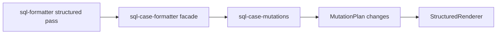

# Structured Case Mutations Split Design

## Goal

Reduce the maintenance cost of the CASE formatter by separating the structured CASE mutation pass from the older string-level CASE formatting compatibility functions, while preserving existing public exports and formatter output.

The default structured pipeline should remain behaviorally equivalent:

```text
FormatDocument -> FormatNodes -> MutationPlan -> apply_case_mutations -> StructuredRenderer
```

The main change is ownership: the live structured mutation implementation should live in a focused module instead of being colocated with `format_case_blocks()` and other legacy string-level CASE helpers in `lib/core/sql-case-formatter.js`.

## Current Problem

`lib/core/sql-case-formatter.js` is now the largest formatter file. It currently mixes:

- string-level CASE formatting used by compatibility exports
- CASE token and layout utility exports kept for older callers
- `render_case_node()` compatibility behavior expected by structured regression tests
- structured CASE mutation logic used by the default formatter pipeline
- CASE indentation, wrapping, nested CASE joining, IN-list layout, and alias spacing helpers

The default formatter path is already structured, but CASE behavior is still difficult to audit because live mutation logic and legacy string reconstruction logic share one file. This raises the risk that future CASE fixes touch the wrong path or accidentally reintroduce string-level CASE rewrites into the default pipeline.

## Proposed Design

### 1. Add `sql-case-mutations.js`

Create `lib/core/sql-case-mutations.js` for structured CASE mutation behavior.

Expected responsibility:

- apply CASE / WHEN / THEN / ELSE / END line layout mutations
- compute CASE base indentation in SELECT, GROUP BY, function-call, and condition contexts
- decide when CASE branch values should wrap based on `caseWhenThenWrapLength`
- join nested CASE values when the structured model allows it
- apply multiline IN-list layout inside WHEN conditions
- preserve compact CASE function-plus expressions
- calculate spacing before `AS` aliases after CASE blocks
- omit blank lines inside structured CASE blocks

Expected public API:

```js
exports.apply_case_mutations = apply_case_mutations;
```

Structured helper functions should remain private unless another structured module has a real need for them.

### 2. Keep `sql-case-formatter.js` as the compatibility facade

Keep `lib/core/sql-case-formatter.js` as the module required by existing callers and tests.

It should continue to export the existing public API:

```js
exports.get_case_tokens = get_case_tokens;
exports.get_case_balance_delta = get_case_balance_delta;
exports.find_top_level_as_loc = find_top_level_as_loc;
exports.get_outer_as_code_width = get_outer_as_code_width;
exports.get_alignment_width_for_code = get_alignment_width_for_code;
exports.format_case_expression_line = format_case_expression_line;
exports.format_case_blocks = format_case_blocks;
exports.apply_case_mutations = apply_case_mutations;
exports.render_case_node = render_case_node;
exports.find_root_case_start_loc = find_root_case_start_loc;
exports.is_case_branch_line = sqlCaseUtils.is_case_branch_line;
```

After the split, `apply_case_mutations` should delegate to `sql-case-mutations.js`. The other exports should remain backed by compatibility/string-level logic in `sql-case-formatter.js`.

`render_case_node()` should remain exported from `sql-case-formatter.js` for compatibility and existing structured regression assertions. It should not be moved unless a later design explicitly changes that public surface.

This keeps `lib/core/sql-formatter.js` unchanged for the first split. The live pipeline can still call:

```js
sqlCaseFormatter.apply_case_mutations(document, nodes, mutations, config);
```

That call reaches the focused structured mutation module through the facade.

### 3. Keep shared helpers local to the owning path

The split should avoid broad shared utility modules. Legacy functions operate on strings and raw token arrays, while structured mutations operate on `FormatDocument`, `FormatNodes`, scopes, and `MutationPlan`.

Small duplicated helper logic is acceptable when it keeps this boundary explicit. The implementation should prefer mechanical movement of structured helper bodies over clever reuse.

If the new mutation module needs document navigation, it should use `lib/core/sql-format-navigation.js`; it must not add local `token_by_index`, `previous_code_token`, `next_code_token`, `active_tokens`, or `scope_by_id` helpers.

## Data Flow

The behavior should remain equivalent to the current live path:



Legacy string-level CASE functions remain available through `sql-case-formatter.js`, but they should not be called by the default structured pipeline.

## Non-Goals

- Do not intentionally change SQL formatting output.
- Do not remove legacy exports.
- Do not move or remove `render_case_node()` from the public `sql-case-formatter.js` surface.
- Do not rewrite CASE formatting behavior.
- Do not split SELECT, comment, or condition formatter files in this pass.
- Do not change root `lib/*.js` shims.
- Do not change `lib/adapters/` or `lib/experimental/ddl/`.
- Do not add global regex parsing over comments, strings, block comments, or quoted identifiers.
- Do not change VS Code configuration behavior or `sqlBeautify.*` options.

## Validation

Because this is a behavior-preserving refactor, validation should focus on equivalence and boundary safety.

Run targeted checks while implementing:

```bash
node tests/case-when.test.js
node tests/structured-pipeline-regression.test.js
node tests/select-alignment.test.js
node tests/pipeline-idempotency.test.js
node tests/module-boundary.test.js
```

Then run:

```bash
npm run test:verify
```

If any formatter output changes, treat it as a regression unless a test explicitly demonstrates that the previous output was wrong and the behavior change is accepted separately.

## Risks And Mitigations

- **Risk: facade drift.** Mitigate by keeping all existing `sql-case-formatter.js` exports and making only `apply_case_mutations` delegate to the new module.
- **Risk: `render_case_node()` compatibility changes.** Mitigate by leaving it in the facade and preserving existing structured regression assertions.
- **Risk: hidden default-pipeline dependency on legacy CASE helpers.** Mitigate by moving only structured mutation helpers and running module-boundary tests that reject `format_case_blocks()` from the default structured path.
- **Risk: local navigation helper duplication returns.** Mitigate by extending boundary checks to cover `sql-case-mutations.js` and requiring `sql-format-navigation.js` for document navigation helpers where needed.
- **Risk: behavior changes in CASE alias spacing, nested CASE joins, or IN-list layout.** Mitigate by moving helper bodies mechanically first and running CASE, structured pipeline, SELECT alignment, and idempotency regressions before any cleanup.
- **Risk: premature over-splitting.** Mitigate by creating one focused structured mutation module in this pass and deferring smaller CASE alias/layout/render helper modules until the first split is stable.

## Success Criteria

- `lib/core/sql-case-mutations.js` owns the structured CASE mutation implementation.
- `lib/core/sql-case-formatter.js` remains the compatibility facade with the same public exports.
- `render_case_node()` remains exported from `sql-case-formatter.js`.
- `lib/core/sql-formatter.js` does not call legacy CASE string-level functions.
- Root shims, adapters, and experimental DDL code remain unchanged.
- Existing formatter output remains unchanged under `npm run test:verify`.
- `sql-case-formatter.js` becomes materially easier to audit because live structured mutation logic is no longer mixed with legacy string-level CASE formatting code.
