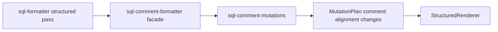

# Structured Comment Mutations Split Design

## Goal

Reduce the maintenance cost of the comment formatter by separating the structured trailing-comment alignment mutation pass from older string-level comment compatibility functions, while preserving existing public exports and formatter output.

The default structured pipeline should remain behaviorally equivalent:

```text
FormatDocument -> FormatNodes -> MutationPlan -> apply_comment_alignment_mutations -> StructuredRenderer
```

The main change is ownership: the live structured comment alignment implementation should live in a focused module instead of being colocated with comment shielding, restore, normalization, and legacy `order_comment()` behavior in `lib/core/sql-comment-formatter.js`.

## Current Problem

`lib/core/sql-comment-formatter.js` is now the largest formatter file. It currently mixes:

- standalone and inline comment protection helpers retained for compatibility
- comment restore and spacing normalization helpers
- older string-level `order_comment()` behavior
- structured trailing-comment alignment mutation logic used by the default formatter pipeline
- width planning that accounts for select, case, condition, separator, line-join, and scope mutations
- comment group bridge rules for SELECT items, HAVING, CASE branch values, joins, and standalone comments

The default formatter path is already structured, but comment behavior is difficult to audit because live mutation logic and legacy comment compatibility logic share one file. This raises the risk that future comment fixes touch the wrong path or accidentally reintroduce string-level comment rewrites into the default pipeline.

## Proposed Design

### 1. Add `sql-comment-mutations.js`

Create `lib/core/sql-comment-mutations.js` for structured comment alignment mutation behavior.

Expected responsibility:

- apply trailing comment alignment mutations
- calculate planned code width after earlier mutation passes
- calculate alignment width for CASE, SELECT, condition, and joined-line contexts
- account for moved separators and token omissions when measuring rendered code
- preserve existing comment group bridge rules between SELECT items, standalone comments, HAVING, CASE branch values, and join/condition blocks
- skip alignment for SQL hints and lines whose comments are already moved by another mutation

Expected public API:

```js
exports.apply_comment_alignment_mutations = apply_comment_alignment_mutations;
```

Structured helper functions should remain private unless another structured module has a real need for them.

### 2. Keep `sql-comment-formatter.js` as the compatibility facade

Keep `lib/core/sql-comment-formatter.js` as the module required by existing callers and tests.

It should continue to export the existing public API:

```js
exports.protect_standalone_comments = protect_standalone_comments;
exports.protect_inline_comments = protect_inline_comments;
exports.restore_comments = restore_comments;
exports.get_first_comment_loc = get_first_comment_loc;
exports.normalize_line_comment_spacing = normalize_line_comment_spacing;
exports.order_comment = order_comment;
exports.apply_comment_alignment_mutations = apply_comment_alignment_mutations;
exports.split_code_and_comment = split_code_and_comment;
```

After the split, `apply_comment_alignment_mutations` should delegate to `sql-comment-mutations.js`. The other exports should remain backed by compatibility/string-level logic in `sql-comment-formatter.js`.

This keeps `lib/core/sql-formatter.js` unchanged for the first split. The live pipeline can still call:

```js
sqlCommentFormatter.apply_comment_alignment_mutations(document, nodes, mutations, config);
```

That call reaches the focused structured mutation module through the facade.

### 3. Keep the first split mechanical

The split should avoid broad helper rewrites. `apply_comment_alignment_mutations()` currently contains local helper functions for planned width rendering, token gap measurement, scope checks, select-item grouping, and condition bridge decisions. The first implementation should move those helper bodies mechanically into `sql-comment-mutations.js` with minimal edits for imports and exports.

Unlike the renderer, SELECT, and CASE splits, this pass should not require replacing every local helper with `sql-format-navigation.js`. The comment alignment code has several width-planning helpers that depend tightly on the local rendered-text simulation. Replacing them while moving the module would mix behavior refactoring into a boundary refactor.

The implementation may add `sql-comment-mutations.js` to module-boundary existence and facade-delegation checks, but it should not add a navigation-helper ban for this module until a later cleanup intentionally rewrites those helpers.

### 4. Strengthen mutation module export boundaries

While touching `tests/module-boundary.test.js`, add precise export surface assertions for focused mutation modules:

```js
Object.keys(sqlSelectMutations).sort()
Object.keys(sqlCaseMutations).sort()
Object.keys(sqlCommentMutations).sort()
```

Expected export lists:

```js
['apply_select_list_mutations']
['apply_case_mutations']
['apply_comment_alignment_mutations']
```

This addresses the existing minor review note without changing formatter behavior.

## Data Flow

The behavior should remain equivalent to the current live path:



Legacy comment protection, restore, normalization, and `order_comment()` functions remain available through `sql-comment-formatter.js`, but they should not be called by the default structured mutation path except for the existing post-render `normalize_line_comment_spacing()` call in `lib/core/sql-formatter.js`.

## Non-Goals

- Do not intentionally change SQL formatting output.
- Do not remove legacy comment exports.
- Do not rewrite comment alignment behavior.
- Do not split SELECT, CASE, or condition formatter files in this pass.
- Do not change `lib/core/sql-formatter.js`.
- Do not change root `lib/*.js` shims.
- Do not change `lib/adapters/` or `lib/experimental/ddl/`.
- Do not add global regex parsing over comments, strings, block comments, or quoted identifiers.
- Do not replace local width-planning helpers with new shared utilities in this pass.
- Do not perform pure indentation cleanup in migrated code as part of this split.
- Do not change VS Code configuration behavior or `sqlBeautify.*` options.

## Validation

Because this is a behavior-preserving refactor, validation should focus on equivalence and boundary safety.

Run baseline checks before implementing:

```bash
node tests/comment-alignment.test.js
node tests/structured-pipeline-regression.test.js
node tests/select-alignment.test.js
node tests/case-when.test.js
node tests/condition-alignment.test.js
node tests/module-boundary.test.js
```

Run syntax and targeted checks after the split:

```bash
node -c lib/core/sql-comment-formatter.js
node -c lib/core/sql-comment-mutations.js
node tests/comment-alignment.test.js
node tests/structured-pipeline-regression.test.js
node tests/select-alignment.test.js
node tests/case-when.test.js
node tests/condition-alignment.test.js
node tests/module-boundary.test.js
```

Then run:

```bash
npm run test:verify
```

If any formatter output changes, treat it as a regression unless a test explicitly demonstrates that the previous output was wrong and the behavior change is accepted separately.

## Risks And Mitigations

- **Risk: comment alignment output drift.** Mitigate by moving helper bodies mechanically first and running comment alignment, structured pipeline, SELECT, CASE, condition, and full verification before any cleanup.
- **Risk: facade drift.** Mitigate by keeping all existing `sql-comment-formatter.js` exports and making only `apply_comment_alignment_mutations` delegate to the new module.
- **Risk: hidden default-pipeline dependency on legacy comment helpers.** Mitigate by keeping `lib/core/sql-formatter.js` unchanged and retaining module-boundary checks that reject legacy structure functions such as `order_comment()` from the structured default path.
- **Risk: over-eager helper consolidation.** Mitigate by deferring local navigation/helper cleanup and shared width utilities until after the module boundary split is stable.
- **Risk: export surface creep in mutation modules.** Mitigate by adding precise export list assertions for SELECT, CASE, and comment mutation modules.
- **Risk: SQL hint or protected comment behavior changes.** Mitigate by running `comment-alignment`, `layout-marker-leakage`, `token-boundary`, and full `test:verify` coverage through the final verification suite.

## Success Criteria

- `lib/core/sql-comment-mutations.js` owns the structured comment alignment mutation implementation.
- `lib/core/sql-comment-mutations.js` exports only `apply_comment_alignment_mutations`.
- `lib/core/sql-comment-formatter.js` remains the compatibility facade with the same public exports.
- `lib/core/sql-formatter.js` continues to call the comment formatter facade and does not call `sql-comment-mutations.js` directly.
- `tests/module-boundary.test.js` guards the new module, facade delegation, and precise mutation module export surfaces.
- Root shims, adapters, and experimental DDL code remain unchanged.
- Existing formatter output remains unchanged under `npm run test:verify`.
- `sql-comment-formatter.js` becomes materially easier to audit because live structured comment alignment logic is no longer mixed with legacy comment compatibility code.
