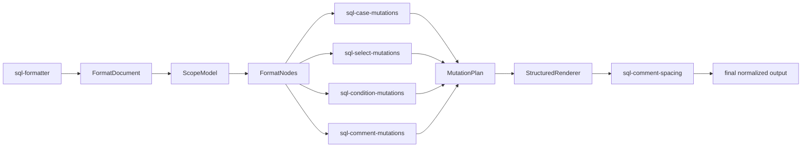

# Structured Formatter Breaking Cleanup Design

## Goal

Bring the structured SQL formatter to a maintainable steady state by removing obsolete string-level formatter compatibility APIs and making the default formatter pipeline depend directly on focused structured modules.

This is a breaking cleanup. The target state is not "legacy functions still exist but are no longer called"; the target state is that obsolete formatter facades and string-level structure passes are gone from the codebase.

The live path should be clear:

```text
FormatDocument -> ScopeModel -> FormatNodes -> focused mutation modules -> StructuredRenderer
```

## Current Problem

Recent cleanup split structured SELECT, CASE, and comment mutations into focused modules:

- `lib/core/sql-select-mutations.js`
- `lib/core/sql-case-mutations.js`
- `lib/core/sql-comment-mutations.js`

However, the repository still keeps large formatter facade files that mix or preserve old string-level behavior:

- `lib/core/sql-select-formatter.js`
- `lib/core/sql-case-formatter.js`
- `lib/core/sql-comment-formatter.js`
- `lib/core/sql-condition-formatter.js`

Those files still expose legacy APIs such as `format_case_blocks()`, `render_case_node()`, `align_as_in_select_blocks()`, `format_select_clause_lists()`, `split_same_line_select_separators()`, `wrap_condition_clauses()`, `align_condition_clauses()`, `order_comment()`, comment protect/restore helpers, `repair_orphan_leading_commas()`, and `apply_trailing_comma_style()`.

The default structured pipeline no longer needs those string-level structure passes. Keeping them creates three problems:

- Maintainers can still accidentally fix or extend the wrong path.
- Module-boundary tests currently protect some obsolete compatibility exports instead of rejecting them.
- The formatter looks only partially migrated even though the product path is already structured.

## Proposed Design

### 1. Make structured mutations the only structure path

`lib/core/sql-formatter.js` should import focused structured modules directly:

```js
var sqlSelectMutations = require('./sql-select-mutations');
var sqlCaseMutations = require('./sql-case-mutations');
var sqlCommentMutations = require('./sql-comment-mutations');
var sqlConditionMutations = require('./sql-condition-mutations');
```

The default mutation sequence remains the same in behavior:

```text
CASE -> SELECT -> clause line breaks -> condition -> scope layout -> keyword case -> comment alignment
```

Only ownership changes. The formatter should no longer import `sql-select-formatter.js`, `sql-case-formatter.js`, `sql-comment-formatter.js`, or `sql-condition-formatter.js` for structured mutation work.

### 2. Add `sql-condition-mutations.js`

Create `lib/core/sql-condition-mutations.js` and move structured condition mutation ownership there:

- `apply_condition_mutations()`
- condition block indentation helpers
- condition connector and continuation indentation helpers
- condition IN-list line join helper

Expected export surface:

```js
exports.apply_condition_mutations = apply_condition_mutations;
```

The module should not export legacy string wrappers such as `wrap_condition_clauses()` or `align_condition_clauses()`.

### 3. Move live comment spacing out of the legacy comment formatter

`lib/core/sql-formatter.js` still needs post-render line-comment spacing normalization. Move that live behavior to a focused non-legacy module, for example:

```text
lib/core/sql-comment-spacing.js
```

Expected export surface:

```js
exports.normalize_line_comment_spacing = normalize_line_comment_spacing;
```

This keeps one small live post-render normalization step without keeping `sql-comment-formatter.js` alive.

### 4. Delete obsolete formatter facades and root shims

After the live pipeline depends directly on the focused modules, delete the obsolete formatter facade files:

- `lib/core/sql-select-formatter.js`
- `lib/core/sql-case-formatter.js`
- `lib/core/sql-comment-formatter.js`
- `lib/core/sql-condition-formatter.js`

Also delete their root compatibility shims:

- `lib/sql-select-formatter.js`
- `lib/sql-case-formatter.js`
- `lib/sql-comment-formatter.js`
- `lib/sql-condition-formatter.js`

Do not delete active root shims such as `lib/sql-formatter.js`, `lib/sql-ddl-formatter.js`, registries, tokenizer, canonical options, or adapter wrappers. Those are still current project entry points or documented internal boundaries.

### 5. Update tests from compatibility protection to cleanup enforcement

`tests/module-boundary.test.js` should stop asserting that obsolete formatter exports exist. Instead it should assert:

- obsolete formatter facade files do not exist
- obsolete root formatter shims do not exist
- `sql-formatter.js` imports focused mutation modules directly
- live formatter dependency graph does not include deleted formatter facades
- structured mutation modules expose only their intended `apply_*_mutations` function

`tests/structured-pipeline-regression.test.js` should stop requiring old formatter facade modules only to check export presence. If it needs structured pass availability checks, it should require the focused mutation modules instead.

## Data Flow

The new live formatter dependency path should be:



Old string-level formatter passes should not appear in this path or remain available through formatter facade modules.

## Non-Goals

- Do not intentionally change SQL formatting output.
- Do not remove `format_sql()` or the VS Code extension entry points.
- Do not delete active structured modules such as `sql-clause-formatter.js`, `sql-layout-formatter.js`, `sql-keywords.js`, `sql-format-document.js`, `sql-scope-model.js`, `sql-format-nodes.js`, or `sql-structured-renderer.js`.
- Do not delete root shims unrelated to obsolete formatter facades.
- Do not change VS Code configuration behavior or restore any `extension.*` compatibility.
- Do not touch `lib/adapters/` or `lib/experimental/ddl/` unless a test proves a direct import must be updated.
- Do not introduce global regex structure rewrites over comments, strings, block comments, or quoted identifiers.
- Do not combine this cleanup with tokenizer/index performance work.
- Do not commit generated `.vsix` artifacts.

## Validation

Before implementation, run baseline checks that cover the current live behavior:

```bash
node tests/module-boundary.test.js
node tests/structured-pipeline-regression.test.js
node tests/comment-alignment.test.js
node tests/case-when.test.js
node tests/select-alignment.test.js
node tests/condition-alignment.test.js
```

During implementation, use targeted syntax checks for all affected live modules:

```bash
node -c lib/core/sql-formatter.js
node -c lib/core/sql-select-mutations.js
node -c lib/core/sql-case-mutations.js
node -c lib/core/sql-comment-mutations.js
node -c lib/core/sql-condition-mutations.js
node -c lib/core/sql-comment-spacing.js
```

After cleanup, run targeted regression:

```bash
node tests/module-boundary.test.js
node tests/structured-pipeline-regression.test.js
node tests/comment-alignment.test.js
node tests/case-when.test.js
node tests/select-alignment.test.js
node tests/condition-alignment.test.js
node tests/canonical-core-boundary.test.js
node tests/pipeline-idempotency.test.js
node tests/token-boundary.test.js
```

Then run full verification:

```bash
npm run test:verify
```

Because this cleanup intentionally changes packaged contents by deleting obsolete files, run packaging smoke and inspect that the generated VSIX does not contain the removed formatter facade files:

```bash
npm run package:vsix
```

If formatter output changes, treat it as a regression unless the implementation explicitly documents and tests an accepted behavior change.

## Risks And Mitigations

- **Risk: accidental behavior drift while deleting old code.** Mitigate by moving condition mutation logic mechanically first, changing imports second, and deleting obsolete facades only after targeted tests pass.
- **Risk: hidden test-only dependencies on old facade exports.** Mitigate by updating tests to import focused modules only when testing live structured behavior.
- **Risk: accidental deletion of current root shims.** Mitigate by deleting only the four obsolete formatter shims and leaving active project entry points intact.
- **Risk: comment spacing behavior changes.** Mitigate by extracting `normalize_line_comment_spacing()` into `sql-comment-spacing.js` without changing its behavior, then running comment, token-boundary, and full regression tests.
- **Risk: module-boundary tests become too weak after old assertions are removed.** Mitigate by adding negative assertions that deleted files stay deleted and focused mutation modules keep exact export surfaces.
- **Risk: breaking cleanup surprises downstream users of internal formatter files.** Mitigate by treating this as an explicit breaking cleanup and documenting that only current product entry points are retained.

## Success Criteria

- `lib/core/sql-formatter.js` directly imports focused structured mutation modules.
- `lib/core/sql-condition-mutations.js` exists and exports only `apply_condition_mutations`.
- `lib/core/sql-comment-spacing.js` owns live line-comment spacing normalization.
- Obsolete formatter facade files are deleted from `lib/core/`.
- Obsolete root formatter shims are deleted from `lib/`.
- Legacy string-level structure APIs are no longer exported anywhere:
  - `format_case_blocks`
  - `render_case_node`
  - `align_as_in_select_blocks`
  - `format_select_clause_lists`
  - `split_same_line_select_separators`
  - `wrap_condition_clauses`
  - `align_condition_clauses`
  - `order_comment`
  - `protect_standalone_comments`
  - `protect_inline_comments`
  - `restore_comments`
  - `repair_orphan_leading_commas`
  - `apply_trailing_comma_style`
- `tests/module-boundary.test.js` enforces the new boundary and exact mutation-module export surfaces.
- `npm run test:verify` passes.
- `npm run package:vsix` passes and the generated package does not contain the deleted formatter facade files.
