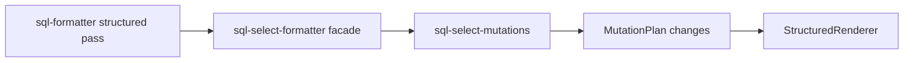

# Structured Select Mutations Split Design

## Goal

Reduce the maintenance cost of the SELECT formatter by separating the structured SELECT mutation pass from the older string-level compatibility formatter functions, while preserving the existing public API and formatter output.

The default structured pipeline should remain behaviorally equivalent:

```text
FormatDocument -> FormatNodes -> MutationPlan -> apply_select_list_mutations -> StructuredRenderer
```

The main change is ownership: the live structured mutation implementation should live in a focused module instead of being colocated with legacy string formatting functions in `lib/core/sql-select-formatter.js`.

## Current Problem

`lib/core/sql-select-formatter.js` is still a large mixed-responsibility file. It currently contains:

- string-level SELECT list formatting used by compatibility exports
- string-level `AS` alignment compatibility logic
- old trailing-comma and orphan-leading-comma compatibility helpers
- structured SELECT list mutation logic used by the default formatter pipeline
- structured `AS` alignment mutation logic
- multiline function item mutation logic
- GROUP BY extension mutation logic

The default formatter path is already structured, but the SELECT implementation is harder to audit because old string-rewrite code and live mutation code share one file. This increases the chance that future SELECT fixes accidentally touch the wrong path or reintroduce string-level rewrites into the default pipeline.

## Proposed Design

### 1. Add `sql-select-mutations.js`

Create `lib/core/sql-select-mutations.js` for structured SELECT mutation behavior.

Expected responsibility:

- apply leading-comma mutations for SELECT and GROUP BY list separators
- join a standalone `SELECT` header with the first item when the existing structured rule allows it
- indent first real select items after SELECT hints and SELECT header comments
- indent standalone comments between SELECT items
- handle multiline top-level function select items
- apply structured `AS` alignment mutations
- apply GROUP BY extension mutations for `WITH CUBE`, `WITH ROLLUP`, and `WITH GROUPING SETS`

Expected public API:

```js
exports.apply_select_list_mutations = apply_select_list_mutations;
```

Helper functions such as structured list indentation, AS-token lookup, rendered item width calculation, multiline function handling, and GROUP BY extension mutation should remain private unless another structured module has a real need for them.

### 2. Keep `sql-select-formatter.js` as the compatibility facade

Keep `lib/core/sql-select-formatter.js` as the module required by existing callers and tests.

It should continue to export the existing public API:

```js
exports.expand_tabs_for_width = expand_tabs_for_width;
exports.format_select_clause_lists = format_select_clause_lists;
exports.apply_select_list_mutations = apply_select_list_mutations;
exports.split_same_line_select_separators = split_same_line_select_separators;
exports.align_as_in_select_blocks = align_as_in_select_blocks;
exports.apply_trailing_comma_style = apply_trailing_comma_style;
exports.repair_orphan_leading_commas = repair_orphan_leading_commas;
```

After the split, `apply_select_list_mutations` should delegate to `sql-select-mutations.js`. The other exports should remain backed by the compatibility/string-level logic in `sql-select-formatter.js`.

This keeps `lib/core/sql-formatter.js` unchanged for the first split. The live pipeline can still call:

```js
sqlSelectFormatter.apply_select_list_mutations(document, nodes, mutations, config);
```

That call reaches the focused structured mutation module through the facade.

### 3. Keep shared helpers local to the owning path

The split should avoid inventing broad shared utility modules. Some helper ideas appear in both legacy and structured code, but they operate on different models:

- legacy functions operate on strings and raw token arrays
- structured mutation functions operate on `FormatDocument`, `FormatNodes`, scopes, and `MutationPlan`

Where the same small helper name appears in both worlds, duplication is acceptable if it keeps the boundary explicit. Examples include simple token tests, indentation text derivation, or select span lookup helpers.

Do not move helpers into root shims or adapters. If the implementation needs document navigation, use `lib/core/sql-format-navigation.js` instead of adding local `token_by_index`, `previous_code_token`, `next_code_token`, `active_tokens`, or `scope_by_id` helpers.

## Data Flow

The behavior should remain equivalent to the current live path:



Legacy string-level functions remain available through `sql-select-formatter.js`, but they should not be called by the default structured pipeline.

## Non-Goals

- Do not intentionally change SQL formatting output.
- Do not remove legacy exports.
- Do not rewrite SELECT formatting behavior.
- Do not split CASE or comment formatter files in this pass.
- Do not change root `lib/*.js` shims.
- Do not change `lib/adapters/` or `lib/experimental/ddl/`.
- Do not add global regex parsing over comments, strings, block comments, or quoted identifiers.
- Do not change VS Code configuration behavior or `sqlBeautify.*` options.

## Validation

Because this is a behavior-preserving refactor, validation should focus on equivalence and boundary safety.

Run targeted checks while implementing:

```bash
node tests/select-alignment.test.js
node tests/structured-pipeline-regression.test.js
node tests/window-function-spacing.test.js
node tests/hive-regression.test.js
node tests/module-boundary.test.js
```

Then run:

```bash
npm run test:verify
```

If any formatter output changes, treat it as a regression unless a test explicitly demonstrates that the previous output was wrong and the behavior change is accepted separately.

## Risks And Mitigations

- **Risk: facade drift.** Mitigate by keeping all existing `sql-select-formatter.js` exports and making only `apply_select_list_mutations` delegate to the new module.
- **Risk: hidden default-pipeline dependency on legacy helpers.** Mitigate by moving only the helpers required by structured mutation behavior and running module-boundary tests that reject legacy structure calls from `sql-formatter.js`.
- **Risk: local navigation helper duplication returns.** Mitigate by extending boundary checks to cover `sql-select-mutations.js` and requiring `sql-format-navigation.js` for document navigation helpers where needed.
- **Risk: behavior changes in AS alignment or multiline function handling.** Mitigate by moving helper bodies mechanically first and running SELECT, structured pipeline, window, and Hive regressions before any cleanup.
- **Risk: premature over-splitting.** Mitigate by creating one focused structured mutation module in this pass and deferring smaller AS/function/group-by modules until the first split is stable.

## Success Criteria

- `lib/core/sql-select-mutations.js` owns the structured SELECT mutation implementation.
- `lib/core/sql-select-formatter.js` remains the compatibility facade with the same public exports.
- `lib/core/sql-formatter.js` does not call legacy SELECT string-level functions.
- Root shims, adapters, and experimental DDL code remain unchanged.
- Existing formatter output remains unchanged under `npm run test:verify`.
- `sql-select-formatter.js` becomes materially easier to audit because live structured mutation logic is no longer mixed with legacy string-level SELECT formatting code.
