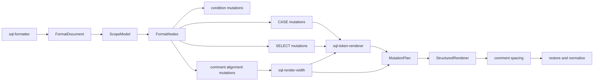
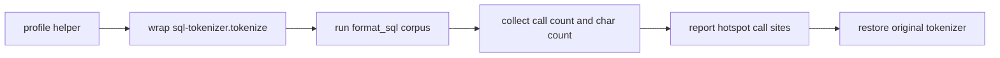

# Structured Tokenizer Profile Cleanup Design

## Goal

Improve the structured SQL formatter's maintainability and performance posture without changing formatter output.

This is a profile-guided cleanup. The target state is not "make the formatter faster by guessing"; the target state is:

- tokenizer and fragment-analysis hotspots are measured before and after the cleanup
- repeated token rendering and width-estimation logic moves out of large mutation modules
- any caching is local to a single format operation and cannot leak across dialects or calls
- existing formatting behavior remains unchanged

The live formatter path should remain:

```text
FormatDocument -> ScopeModel -> FormatNodes -> MutationPlan -> StructuredRenderer -> comment spacing -> restore
```

## Current Problem

The previous breaking cleanup removed obsolete formatter facades and routed the live path through focused structured mutation modules. That left a clearer codebase, but several current modules still carry dense and partly overlapping responsibilities:

- `lib/core/sql-case-mutations.js`
- `lib/core/sql-select-mutations.js`
- `lib/core/sql-comment-mutations.js`
- `lib/core/sql-format-nodes.js`

The repository already has `FormatDocument` indexes and `sql-format-navigation.js`, so this cleanup should not repeat the old "add token index maps" plan. The remaining high-value work is narrower:

- token-to-text rendering rules are duplicated or near-duplicated across CASE and SELECT mutation logic
- comment alignment estimates planned line width by re-rendering code fragments and then calling string-level width helpers
- `get_alignment_width_for_code()` can re-tokenize rendered fragments repeatedly during comment alignment
- there is no stable local instrumentation that explains tokenizer call count, total tokenized characters, or hotspot call sites
- `lib/core/sql-comment-spacing.js` keeps a private unused helper left over from the extraction

This does not mean the formatter is in a bad runtime state. The current performance smoke already keeps a 1000+ statement corpus under the existing threshold. The issue is that further optimization needs evidence, and the current large mutation files still make repeated parsing/rendering behavior easy to copy.

## Proposed Design

### 1. Add tokenizer instrumentation for tests and local profiling

Add a test-only helper, for example:

```text
tests/helpers/formatter-profile.js
```

The helper should wrap `lib/core/sql-tokenizer.tokenize()` inside the current Node process and collect:

- tokenizer call count
- total input characters passed to tokenizer
- total tokenized characters divided by original SQL input characters
- grouped call-site samples, using shallow stack traces or explicit labels

This helper must not be imported by production formatter modules. It exists only for tests, local profiling, and implementation review notes.

Add a targeted profile test around the existing representative corpora:

```text
tests/tokenizer-profile.test.js
```

- `tests/performance-smoke.test.js` corpus
- `tests/structured-differential.test.js` corpus or equivalent extracted fixtures

The profile should avoid hard timing assertions. It may assert that instrumentation runs and that counts stay below a wide upper bound after the implementation baseline is recorded.

### 2. Extract shared token rendering

Create a focused core helper, for example:

```text
lib/core/sql-token-renderer.js
```

It should own deterministic token-to-text rendering used by mutation planning helpers. Expected responsibilities include:

- punctuation spacing for `,`, `;`, `)`, `]`, `.`, and `(`
- unary signed number joining where existing behavior requires it
- window `ORDER BY` spacing preservation
- optional keyword casing based on canonical formatter options
- optional preservation of original comma gap for selected token indexes
- optional spacing around a known parenthesized scope when collapsing a function item

The helper should accept `document`, `tokens`, and explicit rendering options. It should not create mutations, inspect user configuration globally, mutate the document, or replace `StructuredRenderer`.

`sql-case-mutations.js` and `sql-select-mutations.js` should delegate shared rendering behavior to this helper while keeping CASE-specific and SELECT-specific layout decisions in their own modules.

### 3. Extract planned line width and alignment width logic

Create a focused helper, for example:

```text
lib/core/sql-render-width.js
```

It should own width estimation for comment alignment under an existing `MutationPlan`. Expected responsibilities include:

- render the effective code segment for a physical line after relevant token omissions, replacements, line breaks, spacing, line indents, separator moves, and line joins
- compute display width with tab expansion
- compute alignment width before a top-level `AS`
- expose small functions that `sql-comment-mutations.js` can call instead of nesting a large width engine inside `apply_comment_alignment_mutations()`

The helper should not decide which comment lines belong to an alignment group. That grouping remains in `sql-comment-mutations.js`.

### 4. Use per-format local caching only where profiling proves repetition

If the baseline profile shows repeated calls for the same rendered code fragment, add local caching for pure fragment analysis such as top-level `AS` lookup and alignment width.

The cache must be scoped to one format operation or one helper invocation context. It must not be a module-level global cache.

Cache keys must include the tokenizer-affecting options when tokenization is involved. At minimum, a safe key should include the rendered text and a stable serialization of relevant tokenizer options or dialect capabilities. If a safe key is not straightforward, skip caching for that path.

### 5. Remove leftover unused private helper

Remove the private unused `is_mysql_hash_comment_enabled()` helper from `lib/core/sql-comment-spacing.js`.

This is allowed in the same implementation because it is directly related to the comment spacing extraction tail and has no export or behavior impact.

## Data Flow

The production formatter flow remains unchanged:



The profile flow is test-only:



## Non-Goals

- Do not change formatter output intentionally.
- Do not change user-facing configuration, commands, README behavior documentation, or diagnostics.
- Do not restore deleted formatter facades, root formatter shims, or obsolete string-level formatter APIs.
- Do not introduce parser-level SQL grammar changes.
- Do not add module-level global caches for tokenization or fragment analysis.
- Do not move `StructuredRenderer` responsibilities into mutation modules.
- Do not touch `lib/adapters/` or `lib/experimental/ddl/`.
- Do not add broad regex rewrites over comments, strings, block comments, dollar strings, quoted identifiers, or placeholders.
- Do not commit generated `.vsix` artifacts.

## Validation

Before implementation, record baseline behavior and profile numbers:

```bash
node tests/performance-smoke.test.js
node tests/structured-differential.test.js
node tests/tokenizer-profile.test.js
```

After extracting shared token rendering, run targeted output guards:

```bash
node tests/case-when.test.js
node tests/select-alignment.test.js
node tests/window-function-spacing.test.js
node tests/structured-differential.test.js
node tests/pipeline-idempotency.test.js
```

After extracting width logic and any local cache, run comment and token guards:

```bash
node tests/comment-alignment.test.js
node tests/token-boundary.test.js
node tests/pipeline-idempotency.test.js
node tests/tokenizer-profile.test.js
```

Run syntax checks for all changed live modules:

```bash
node -c lib/core/sql-case-mutations.js
node -c lib/core/sql-select-mutations.js
node -c lib/core/sql-comment-mutations.js
node -c lib/core/sql-token-renderer.js
node -c lib/core/sql-render-width.js
node -c lib/core/sql-comment-spacing.js
```

Then run full verification:

```bash
npm run test:verify
```

Because new core files may change packaged extension contents, run packaging smoke and do not commit the generated artifact:

```bash
npm run package:vsix
```

The implementation notes should record:

- baseline profile call count and tokenized character ratio
- post-cleanup profile call count and tokenized character ratio
- whether `tests/performance-smoke.test.js` elapsed time improved, stayed flat, or regressed

## Risks And Mitigations

- **Risk: token rendering extraction changes subtle spacing behavior.** Mitigate by moving behavior mechanically, keeping CASE/SELECT decision logic in place, and treating any output diff as a regression unless separately approved.
- **Risk: cache key misses tokenizer-affecting options.** Mitigate by using per-format local caches only, including tokenizer options in keys, and skipping caching where the correct key is unclear.
- **Risk: profile tests become brittle on slow CI hardware.** Mitigate by avoiding tight time assertions and using profile counts as evidence plus wide regression guards, not as microbenchmark gates.
- **Risk: helper extraction hides comment alignment policy changes.** Mitigate by keeping grouping decisions in `sql-comment-mutations.js`; `sql-render-width.js` should estimate width only.
- **Risk: new helper modules become another dumping ground.** Mitigate by enforcing narrow responsibilities through module-boundary tests and exact export assertions where practical.
- **Risk: profiling monkey patch leaks between tests.** Mitigate by restoring the original tokenizer function in `finally` blocks and keeping the helper isolated to the test process.

## Success Criteria

- A test-only tokenizer profile helper exists and reports tokenizer calls, total tokenized characters, character ratio, and hotspot sources.
- Profile baseline and post-cleanup numbers are recorded during implementation.
- Shared token rendering rules live in a focused helper instead of being duplicated across CASE and SELECT mutation modules.
- Comment alignment width estimation lives in a focused helper, while alignment grouping remains in `sql-comment-mutations.js`.
- Any caching is local to a single format operation or helper invocation context and cannot leak across dialects or calls.
- `lib/core/sql-comment-spacing.js` no longer contains the unused private helper.
- Formatter output remains unchanged under targeted regressions and `npm run test:verify`.
- `npm run package:vsix` passes and generated `.vsix` files remain untracked.
