# SQL Formatter Architecture

This document defines the maintained SQL Beautify 2.x architecture. User-facing behavior belongs in `README.md`; breaking upgrade steps belong in `docs/migration-to-2.0.md`.

## Source and dependency boundaries

- `src/core/lexer/` is the lossless lexer. It owns UTF-16 source spans, maximal-munch dialect lexemes, and exact comment/string/identifier bytes.
- `src/core/syntax/` builds the formatter-oriented lossless CST, applies bounded recovery, recognizes unsupported constructs, and validates tree/token-table invariants.
- `src/core/analysis/` builds immutable structural indexes and trivia ownership once per request.
- `src/core/layout/` is the only formatting-policy layer. It emits bounded Layout IR and explicit verbatim claims; it does not edit final strings.
- `src/core/renderer/` is the only formatted-whitespace authority. It renders Layout IR, applies approved keyword case, and produces source-map facts.
- `src/core/api/` and `src/core/config/` own the public result and canonical options contracts.
- `src/adapters/transaction/` owns document/range/multi-selection atomicity. `src/adapters/executor/` owns direct/worker routing, cancellation, timeout, stale-response, and lifecycle boundaries.
- `src/adapters/vscode/` maps canonical settings, providers, commands, diagnostics, selections, and extension lifecycle without owning SQL layout.
- `src/experimental/ddl/` contains the explicitly separate Hive DDL formatter and Extract DDL implementation.

`src/core/**` must not import adapters, VS Code, or experimental DDL. Adapter and DDL code may consume public or explicitly internal core contracts, never the reverse. TypeScript `strict` mode and immutable result objects make these boundaries executable.

## Formatting pipeline

```mermaid
flowchart LR
    A["source + canonical options"] --> B["lossless lexer"]
    B --> C["formatter-oriented CST"]
    C --> D["dialect validation + bounded recovery"]
    D --> E["structural indexes + trivia binding"]
    E --> F["layout policy"]
    F --> G["Layout IR + verbatim claims"]
    G --> H["single renderer"]
    H --> I["token equivalence + source-map checks"]
    I --> J["structured FormatResult"]
```

Leaves partition the original JavaScript string by end-exclusive UTF-16 code-unit offsets. Comments, strings, quoted identifiers, parameters, dialect literals, and opaque/verbatim structures retain their exact source slices. No global whitespace or SQL regular-expression pass is allowed after rendering.

Parser recovery is deliberately bounded. When the formatter can prove a construct boundary, it may preserve that range verbatim; when it can only prove a statement or target boundary, it preserves the broader unit. It never guesses through an unbounded malformed structure.

Analysis constructs parent/ancestor, statement/clause, list/separator, trivia, offset, and dialect capability indexes once. Layout and renderer code query those indexes instead of repeatedly rescanning all leaves or nodes. Resource-budget and performance tests guard against accidental superlinear work.

## Public result contract

`formatSql(source, options)` is document-only and returns one of:

- `formatted`: safe changed text, diagnostics, and a validated source map;
- `unchanged`: safe identical text, diagnostics, and a validated source map;
- `preserved`: exact original text and diagnostics, without a source map;
- `failed`: exact original text and diagnostics, without a source map.

Canonical options are `dialect`, `keywordCase`, `commaStyle`, `indentStyle`, `maxAlignWidth`, `caseWhenThenWrapLength`, `caseLayout`, and `unsupportedSyntaxPolicy`. The default dialect is `hive`; the default unsupported policy is `warn`. Proxies, accessors, exotic option objects, unknown keys, and invalid values fail closed.

The public package exports are intentionally narrow:

- `vscode-sql-beautify/formatter`: `formatSql`, `lexSql`;
- `vscode-sql-beautify/experimental/ddl`: `formatHiveDdl`, `extractDdl`;
- `vscode-sql-beautify/package.json`.

The package root and internal runtime paths are not public exports.

## Adapter and transaction contract

Document, range, and multi-selection formatting share one transaction sequence:

1. snapshot document identity, version, source, targets, options, and cancellation state;
2. validate target ownership, balance, protected boundaries, non-overlap, and configuration;
3. compute every target before constructing edits;
4. recheck document identity, version, and source immediately before one host commit;
5. commit all edits once, or no edits at all.

Range formatting only accepts complete, structurally safe fragments. Any cancellation, stale state, preservation, failure, malformed executor response, or host rejection returns no partial edits. Selection direction is preserved through the validated source map.

Small requests use the direct executor. Large requests use one persistent worker selected by explicit source/leaf thresholds. Both load `dist/runtime.cjs`; requests bind identity, generation, version, target, source digest, and runtime digest. Timeout, crash, malformed or stale responses, backpressure, cancellation, and disposal fail closed.

The VS Code adapter only handles the explicit `sql` and `hive-sql` language IDs. It reads `sqlBeautify.*` at the document/language scope, publishes safe diagnostics, and registers only the four `sqlBeautify.*` commands declared in `package.json`.

## Experimental Hive DDL

The DDL formatter accepts only a fully consumed Hive `CREATE TABLE` subset. It preserves complete input for comments, constraints, defaults, unknown suffixes, malformed delimiters, and multiple statements.

Extract DDL consumes query CST ownership and requires one complete, unambiguous projection schema. Wildcards, unresolved expressions without aliases, duplicate Hive output names, malformed aliases, and set-branch schema mismatches reject the entire operation. The only wildcard scalar accepted by projection safety is exact `count(*)`. No type inference is claimed; the default output type is `__TYPE_REQUIRED__`.

DDL command batches use their own all-or-nothing transaction. Only diagnostic-free, non-empty `formatted`/`unchanged` or `extracted` results reach the host commit.

## Production artifacts and packaging

`npm run build:v2-runtime` creates exactly five ignored artifacts:

- `dist/runtime.cjs`: the single production core plus internal adapter runtime;
- `dist/sql-formatter.cjs`: public formatter facade loading the shared runtime;
- `dist/hive-ddl.cjs`: public experimental DDL facade loading the shared runtime;
- `dist/formatter-worker.cjs`: persistent worker entry;
- `dist/extension.cjs`: VS Code host wiring.

`package.json.files` is the package and VSIX allowlist. Source, tests, scripts, technical docs, agent files, dependencies, and temporary output must not enter the VSIX. `prepack` builds runtime artifacts so a clean checkout cannot produce a package with dangling `main` or `exports`.

PR/push CI runs with `contents: read`. Only the manual `main` release job receives `contents: write`. Release gates require package, lockfile, VSIX manifest, VSIX filename, tag, workflow SHA, `origin/main`, and GitHub Release target to identify the same version and commit.

## Maintained verification gates

- `npm run typecheck:v2`: strict TypeScript contracts;
- `npm run test:v2:wave1` through `npm run test:v2:wave5`: lexer, CST, analysis, layout, renderer, adapter, DDL, cutover, packaging, property, and performance gates;
- `npm run test:verify`: the complete maintained regression aggregate;
- `npm run verify:clean-package`: isolated clean-source npm package lifecycle and public facade smoke;
- `npm run package:vsix`: build, package, and inspect the versioned VSIX;
- `npm exec -- vsce ls --tree --no-dependencies`: human-readable package inventory;
- `git diff --check`: patch hygiene.

The generated `docs/technical/sql-support-matrix.md` is the single capability authority and must byte-match `scripts/generate-v2-support-matrix.js --check` after the core registry is built.
