# SQL Formatter Architecture

This document is for maintainers. User-facing behavior belongs in `README.md`.

## Boundaries

- `lib/core/`: SQL formatting core. It owns tokenization, shielding, canonical options, registries, clause splitting, comment/code line modeling, case/select/condition formatting, layout rendering, and keyword casing.
- `lib/adapters/`: host integration. It owns VS Code configuration mapping, VS Code command/provider orchestration, range-safety enforcement, and user-facing diagnostics.
- `lib/experimental/ddl/`: experimental Hive DDL formatting and Extract DDL. It is intentionally outside the main SQL formatter responsibility layer.
- Root `lib/*.js` files are compatibility shims only. They must remain single-line re-exports and must not contain formatter logic.
- `lib/core/sql-token-primitives.js`: shared token-aware primitives for top-level item splitting and code/comment boundaries. New SQL boundary logic must reuse it instead of re-implementing character scans.

## Pipeline

```mermaid
flowchart LR
    A["adapter canonical options"] --> B["core sql-formatter"]
    B --> C["SET / opaque protection"]
    C --> D["tokenize once"]
    D --> E["FormatDocument"]
    E --> F["ScopeModel"]
    F --> G["FormatNodes"]
    G --> H["structured passes create MutationPlan"]
    H --> I["invariant guard"]
    I --> J["StructuredRenderer"]
    J --> K["controlled restore and final whitespace"]
```

## Core Rules

- Core accepts canonical option names only: `keywordCase`, `commaStyle`, `indentStyle`, `maxAlignWidth`, `caseWhenThenWrapLength`, `dialect`, and `unsupportedSyntaxPolicy`.
- Core must not import `lib/adapters/` or `lib/experimental/`.
- VS Code configuration accepts `sqlBeautify.*` only. Positional `vkbeautify.sql(...)` arguments remain a wrapper responsibility for the JS API.
- Comments, strings, block comments, quoted identifiers, and opaque unsupported syntax must never be treated as active SQL code by structure passes.
- Structure passes consume `FormatDocument`, `ScopeModel`, and `FormatNodes`; they must not re-derive SELECT, CASE, condition, list, or comment ownership from restored raw strings.
- No structural pass may run after line comments are restored to real user-authored comment text.
- Comment/layout interaction must use code/comment records, scope ownership, or mutation records, not fake SQL marker strings.
- Layout must render the requested indentation directly. It must not render tabs first and globally replace them later.
- Output whitespace contract: preserve at most one user blank line between logical blocks, normalize line endings to LF, and emit exactly one trailing newline.
- Range formatting contract: only whole-line, clause-safe, structurally balanced fragments are formatted; unsafe fragments are rejected rather than speculatively rewritten.

## Structured Format Model

`lib/core/sql-format-document.js` builds the lossless per-format `FormatDocument`: source text, tokenizer records, physical line records, protected token classification, diagnostics, scopes, and extracted nodes. `lib/core/sql-format-model.js` remains a legacy compatibility facade for old line-level consumers and should not gain new structure ownership logic.

`lib/core/sql-scope-model.js` owns structural ranges such as query, CASE expression, condition block, function call, IN-list, window spec, and parenthesized list. Close-paren indentation facts belong on the owning scope, not in per-pass bracket counters.

`lib/core/sql-format-nodes.js` extracts pass-level nodes such as SELECT/GROUP BY items, CASE branches, condition segments, comment bindings, and separators. Separators must always carry an owner scope so comma mutations cannot accidentally affect function arguments or IN-list values.

`lib/core/sql-format-mutations.js` is the only write plan for structure passes. Passes add declarative token, separator, indentation, and comment-alignment mutations; they do not edit final strings directly.

`lib/core/sql-structured-renderer.js` is the single rendering boundary for the structured pipeline. It applies mutations deterministically, renders comments from bound comment tokens, preserves protected token bytes, and enforces the final whitespace contract.

## Verification Contract

- `tests/module-boundary.test.js` checks the live core source graph for forbidden legacy markers and dependency direction.
- `tests/canonical-core-boundary.test.js` checks canonical options through the core path.
- `tests/layout-marker-leakage.test.js` protects user-authored text that resembles removed historical markers.
- `tests/generated-support-matrix.test.js` keeps `docs/technical/sql-support-matrix.md` synchronized with clause/operator registries.

## Unsupported Policy

Unsupported syntax detection has two inputs:

- Opaque protection for constructs whose body must not be rewritten.
- A lightweight syntax risk detector for known dialect mismatches or known unmodeled constructs.

This is still not a full parser. The policy means "known low-confidence syntax", not "every possible unsupported SQL grammar form". Opaque constructs must be preserved through shielding before broad rewrites; detector-only findings are context-aware and are reported without implying that every detected fragment was isolated as an opaque preserved segment. Experimental DDL should remain clearly labeled and tested separately.

Detector findings must not be based on word value alone. Keyword-shaped identifiers, aliases, and expression function names such as `qualify`, `merge`, or `pivot` are valid formatter inputs unless they appear at a recognized clause or table-construct boundary. Clause splitting follows the same rule so a `SELECT qualify AS c` list item is not rewritten into a `QUALIFY` clause.

`unsupportedSyntaxPolicy` currently supports:

- `preserve`: keep protected opaque syntax intact, record detected low-confidence syntax, and continue formatting around it
- `warn`: keep formatting behavior, and emit a runtime warning through the adapter diagnostics path; the warning does not imply every detected fragment was opaque-preserved
- `bail_out`: abort formatting when known low-confidence syntax is detected

## Diagnostics Contract

- Formatter exceptions surface as user-visible errors and do not replace the source text.
- Unsafe range fragments are rejected in both the VS Code range formatter and command-driven selection formatting.
- `warn` diagnostics are user-visible warnings, not debug-only logs.
- `sqlBeautify.debugDiagnostics=true` adds structured payloads to the extension host console; it does not change formatting behavior.
