# SQL Formatter Architecture

This document is for maintainers. User-facing behavior belongs in `README.md`.

## Boundaries

- `lib/core/`: SQL formatting core. It owns tokenization, shielding, canonical options, registries, clause splitting, comment/code line modeling, case/select/condition formatting, layout rendering, and keyword casing.
- `lib/adapters/`: host integration. It owns VS Code configuration mapping, VS Code command/provider orchestration, range-safety enforcement, and user-facing diagnostics.
- `lib/experimental/ddl/`: experimental Hive DDL formatting and Extract DDL. It is intentionally outside the main SQL formatter responsibility layer.
- Root `lib/*.js` files are compatibility shims only. They must remain single-line re-exports and must not contain formatter logic.
- `lib/core/sql-token-primitives.js`: shared token-aware primitives for top-level item splitting and code/comment boundaries. New SQL boundary logic must reuse it instead of re-implementing character scans.
- `lib/core/sql-clause-context.js`: shared token-aware context helper for clause splitting, syntax-risk detection, and structured clause mutation boundaries. `QUALIFY`, `PIVOT` / `UNPIVOT`, `MERGE`, and `MATCH_RECOGNIZE` detection must use this helper rather than duplicating local word-value checks.
- `lib/core/sql-safe-diagnostic-report.js`: local-only report builder for restricted production debugging. It emits counts, classifications, safe labels, and timings only; it must not render raw SQL, formatted SQL, token values, file paths, URLs, unsupported snippets, or adapter state.
- `lib/adapters/safe-diagnostic-report.js`: VS Code command adapter for copying a fresh safe diagnostic report from the active document or selection. It owns clipboard integration and user messages.
- Obsolete structured formatter facades such as `sql-select-formatter.js`, `sql-case-formatter.js`, `sql-comment-formatter.js`, and `sql-condition-formatter.js` are removed. Do not recreate them as compatibility wrappers; live structured behavior belongs in the focused modules below.

## Pipeline

```mermaid
flowchart LR
    A["adapter canonical options"] --> B["core sql-formatter"]
    B --> C["SET / opaque protection"]
    C --> D["tokenize once"]
    D --> E["FormatDocument"]
    E --> F["ScopeModel"]
    F --> G["FormatNodes"]
    G --> H["structured passes create MutationPlan"]
    H --> I["invariant guard"]
    I --> J["StructuredRenderer"]
    J --> K["controlled restore and final whitespace"]
```

## Core Rules

- Core accepts canonical option names only: `keywordCase`, `commaStyle`, `indentStyle`, `maxAlignWidth`, `caseWhenThenWrapLength`, `dialect`, and `unsupportedSyntaxPolicy`.
- Core must not import `lib/adapters/` or `lib/experimental/`.
- VS Code configuration accepts `sqlBeautify.*` only. Positional `vkbeautify.sql(...)` arguments remain a wrapper responsibility for the JS API.
- Comments, strings, block comments, quoted identifiers, and opaque unsupported syntax must never be treated as active SQL code by structure passes.
- Structure passes consume `FormatDocument`, `ScopeModel`, and `FormatNodes`; they must not re-derive SELECT, CASE, condition, list, or comment ownership from restored raw strings.
- No structural pass may run after line comments are restored to real user-authored comment text.
- Comment/layout interaction must use code/comment records, scope ownership, or mutation records, not fake SQL marker strings.
- Layout must render the requested indentation directly. It must not render tabs first and globally replace them later.
- Output whitespace contract: preserve at most one user blank line between logical blocks, normalize line endings to LF, and emit exactly one trailing newline.
- Range formatting contract: only whole-line, clause-safe, structurally balanced fragments are formatted; unsafe fragments are rejected rather than speculatively rewritten.

## Structured Format Model

`lib/core/sql-format-document.js` builds the lossless per-format `FormatDocument`: source text, tokenizer records, physical line records, protected token classification, diagnostics, scopes, and extracted nodes. `lib/core/sql-format-model.js` remains a legacy compatibility facade for old line-level consumers and should not gain new structure ownership logic.

`lib/core/sql-scope-model.js` owns structural ranges such as query, CASE expression, condition block, function call, IN-list, window spec, and parenthesized list. Close-paren indentation facts belong on the owning scope, not in per-pass bracket counters.

`lib/core/sql-format-nodes.js` is the thin public orchestrator for pass-level nodes. Concrete extraction is split into focused modules:

- `sql-list-nodes.js`: SELECT/GROUP BY list spans and separator ownership
- `sql-select-item-nodes.js`: SELECT/GROUP BY item nodes
- `sql-case-nodes.js`: CASE expression and branch nodes
- `sql-condition-nodes.js`: condition block and segment nodes
- `sql-node-utils.js`: shared token predicates and range helpers

Separators must always carry an owner scope so comma mutations cannot accidentally affect function arguments or IN-list values.

`lib/core/sql-format-mutations.js` is the only write plan for structure passes. Passes add declarative token, separator, indentation, and comment-alignment mutations; they do not edit final strings directly.

Structured mutation implementations are split by responsibility:

- `sql-select-mutations.js`: SELECT/GROUP BY item layout, comma placement, and AS alignment mutations
- `sql-case-mutations.js`: CASE branch layout mutations
- `sql-condition-mutations.js`: condition clause and connector mutations
- `sql-comment-mutations.js`: trailing and bound comment alignment mutations
- `sql-comment-spacing.js`: final line-comment spacing normalization

These modules expose only their `apply_*_mutations` entry points, except `sql-comment-spacing.js`, which exposes only `normalize_line_comment_spacing`.

`lib/core/sql-structured-renderer.js` is the single rendering boundary for the structured pipeline. It applies mutations deterministically, renders comments from bound comment tokens, preserves protected token bytes, and enforces the final whitespace contract. Its implementation delegates focused helper work to `sql-render-move-state.js`, `sql-render-indent.js`, `sql-render-token-spacing.js`, `sql-render-line.js`, `sql-render-width.js`, and `sql-token-renderer.js`. Token-adjacency spacing policy lives in `sql-render-token-spacing.js`; final line rendering, planned-width calculation, and snippet rendering must share that policy. `sql-token-renderer.js` is the mutation-facing facade and must not carry private comma, parenthesis, operator, or window spacing rules.

## Verification Contract

- `tests/module-boundary.test.js` checks the live core source graph for forbidden legacy markers and dependency direction.
- `tests/canonical-core-boundary.test.js` checks canonical options through the core path.
- `tests/layout-marker-leakage.test.js` protects user-authored text that resembles removed historical markers.
- `tests/generated-support-matrix.test.js` keeps `docs/technical/sql-support-matrix.md` synchronized with clause/operator registries.
- `tests/tokenizer-profile.test.js` and the performance smoke test are regression guards for tokenizer churn and accidental path blowups. They are not proof that every maintainability refactor improves wall-clock time.
- `tests/production-corpus-golden.test.js` locks committed anonymized production-shaped SQL against readable `.formatted.sql` snapshots. Snapshot updates require `SQL_BEAUTIFY_UPDATE_SNAPSHOTS=1`.
- `tests/production-performance-budget.test.js` reports corpus p50/p95/max timing and uses wide gates as disaster guards, not exact performance promises.
- Packaging smoke must confirm new runtime core modules are included in the VSIX and obsolete formatter facades are absent when module structure changes.

## Unsupported Policy

Unsupported syntax detection has two inputs:

- Opaque protection for constructs whose body must not be rewritten.
- A lightweight syntax risk detector for known dialect mismatches or known unmodeled constructs.

This is still not a full parser. The policy means "known low-confidence syntax", not "every possible unsupported SQL grammar form". Opaque constructs must be preserved through shielding before broad rewrites; detector-only findings are context-aware and are reported without implying that every detected fragment was isolated as an opaque preserved segment. Experimental DDL should remain clearly labeled and tested separately.

Detector findings must not be based on word value alone. Keyword-shaped identifiers, aliases, and expression function names such as `qualify`, `merge`, or `pivot` are valid formatter inputs unless they appear at a recognized clause or table-construct boundary. Clause splitting follows the same rule so a `SELECT qualify AS c` list item is not rewritten into a `QUALIFY` clause.

`lib/core/sql-clause-context.js` is the shared boundary implementation for this policy. Clause splitting, syntax-risk detection, and structured clause mutations must route low-confidence clause decisions through it so `QUALIFY`, `PIVOT` / `UNPIVOT`, `MERGE`, and `MATCH_RECOGNIZE` context rules do not drift across separate modules.

`unsupportedSyntaxPolicy` currently supports:

- `preserve`: keep protected opaque syntax intact, record detected low-confidence syntax, and continue formatting around it
- `warn`: keep formatting behavior, and emit a runtime warning through the adapter diagnostics path; the warning does not imply every detected fragment was opaque-preserved
- `bail_out`: abort formatting when known low-confidence syntax is detected

## Diagnostics Contract

- Formatter exceptions surface as user-visible errors and do not replace the source text.
- Unsafe range fragments are rejected in both the VS Code range formatter and command-driven selection formatting.
- `warn` diagnostics are user-visible warnings, not debug-only logs.
- `sqlBeautify.debugDiagnostics=true` adds structured payloads to the extension host console; it does not change formatting behavior.
- Unsupported syntax diagnostics use structured segment metadata: `kind`, `code`, `label`, `text`, `snippet`, `range`, `source`, `confidence`, and `action`.
- `format_sql()` remains text-only. Normal `format_sql_detailed()` remains `{ text, diagnostics }` and is the diagnostics-bearing API.
- `format_sql_detailed(text, { includeTelemetry: true })` is an internal diagnostic mode. It may return `telemetry` and `safeReport`, and formatter errors may carry `error.sqlBeautifyTelemetry`; this flag is not a public VS Code setting and must not change formatted output.
- `SQL Beautify: Copy Safe Diagnostic Report` (`sqlBeautify.copySafeDiagnosticReport`) copies a local Markdown report only when the user explicitly runs the command. The report is for restricted-environment debugging and must not contain SQL content, formatted SQL, identifiers, literals, comments, paths, URLs, or unsupported segment snippets.
- Private production SQL can be checked locally with `SQL_BEAUTIFY_CORPUS_DIR=/path/to/sql node tests/production-corpus-private.test.js`; private corpus contents must not be committed.
