# SQL Formatter Architecture

This document is for maintainers. User-facing behavior belongs in `README.md`.

## Boundaries

- `lib/core/`: SQL formatting core. It owns tokenization, shielding, canonical options, registries, clause splitting, comment/code line modeling, case/select/condition formatting, layout rendering, and keyword casing.
- `lib/adapters/`: compatibility and host integration. It owns VS Code configuration mapping, VS Code command/provider orchestration, and legacy option normalization.
- `lib/experimental/ddl/`: experimental Hive DDL formatting and Extract DDL. It is intentionally outside the main SQL formatter responsibility layer.
- Root `lib/*.js` files are compatibility shims only. They must remain single-line re-exports and must not contain formatter logic.

## Pipeline

```mermaid
flowchart LR
    A["adapter canonical options"] --> B["core sql-formatter"]
    B --> C["SET payload protection"]
    C --> D["token shield"]
    D --> E["comment protection"]
    E --> F["opaque clause protection"]
    F --> G["lexical normalization"]
    G --> H["clause splitting"]
    H --> I["select/condition/layout passes"]
    I --> J["restore comments and shields"]
    J --> K["case/select/comment alignment"]
    K --> L["keyword case"]
    L --> M["opaque restore and comment spacing"]
```

## Core Rules

- Core accepts canonical option names only: `keywordCase`, `commaStyle`, `indentStyle`, `maxAlignWidth`, `caseWhenThenWrapLength`, `dialect`, and `unsupportedSyntaxPolicy`.
- Core must not import `lib/adapters/` or `lib/experimental/`.
- Legacy `extension.*` settings and positional `vkbeautify.sql(...)` arguments are adapter responsibilities.
- Comments, strings, block comments, quoted identifiers, and opaque unsupported syntax must be protected before broad formatting passes.
- Comment/layout interaction must use code/comment models or explicit state, not fake SQL marker strings.
- Layout must render the requested indentation directly. It must not render tabs first and globally replace them later.

## Verification Contract

- `tests/module-boundary.test.js` checks the live core source graph for forbidden legacy markers and dependency direction.
- `tests/canonical-core-boundary.test.js` checks canonical options through the core path.
- `tests/layout-marker-leakage.test.js` protects user-authored text that resembles removed historical markers.
- `tests/generated-support-matrix.test.js` keeps `docs/technical/sql-support-matrix.md` synchronized with clause/operator registries.

## Unsupported Policy

The formatter is not a full SQL parser. When confidence is low, preserve syntax through token shielding or opaque protection rather than performing speculative rewrites. Experimental DDL should remain clearly labeled and tested separately.
